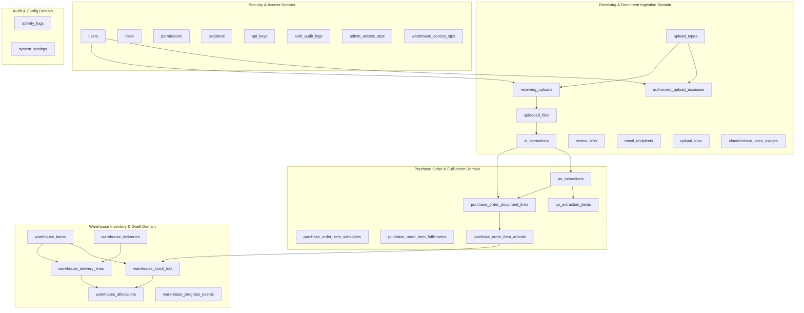

# Database Structure & Schema Reference

This document provides a comprehensive technical reference for the application database schema. The database powers document-based receiving workflows, AI-assisted data extractions, Purchase Order matching and fulfillment reporting, and physical warehouse inventory tracking (FIFO lot allocation & dwell time analysis).

---

## 1. Architectural Overview & Domain Breakdown

The database consists of **27 primary tables** structured across **5 core functional domains**:



---

## 2. Security & Identity Domain

### `users`
Core user account records supporting email authentication, status management, and two-factor authentication (2FA).

| Column | Data Type | Nullable | Default | Constraints & Indexes | Description |
| :--- | :--- | :---: | :--- | :--- | :--- |
| `id` | `bigint` | No | Auto-inc | Primary Key | Unique user identifier |
| `name` | `varchar(255)` | No | | | User's full name |
| `email` | `varchar(255)` | No | | Unique | Primary email address |
| `email_verified_at` | `timestamp` | Yes | `NULL` | | Timestamp of email verification |
| `password` | `varchar(255)` | No | | | Hashed account password |
| `status` | `varchar(255)` | No | `'active'` | Index | User account status (`active`, `inactive`, `suspended`) |
| `remember_token` | `varchar(100)` | Yes | `NULL` | | Session remember token |
| `two_factor_secret` | `text` | Yes | `NULL` | | Encrypted TOTP 2FA secret |
| `two_factor_recovery_codes` | `text` | Yes | `NULL` | | Encrypted 2FA emergency recovery codes |
| `two_factor_confirmed_at` | `timestamp` | Yes | `NULL` | | Timestamp when 2FA was confirmed |
| `created_at` | `timestamp` | Yes | `NULL` | | Creation timestamp |
| `updated_at` | `timestamp` | Yes | `NULL` | | Last update timestamp |

---

### `password_reset_tokens`
Standard Laravel password reset tokens table.

| Column | Data Type | Nullable | Default | Constraints & Indexes | Description |
| :--- | :--- | :---: | :--- | :--- | :--- |
| `email` | `varchar(255)` | No | | Primary Key | User email address |
| `token` | `varchar(255)` | No | | | Password reset token hash |
| `created_at` | `timestamp` | Yes | `NULL` | | Token creation timestamp |

---

### `sessions`
HTTP session storage table for stateful authentication.

| Column | Data Type | Nullable | Default | Constraints & Indexes | Description |
| :--- | :--- | :---: | :--- | :--- | :--- |
| `id` | `varchar(255)` | No | | Primary Key | Session identifier |
| `user_id` | `bigint` | Yes | `NULL` | Index | Foreign Key -> `users.id` |
| `ip_address` | `varchar(45)` | Yes | `NULL` | | Client IP address |
| `user_agent` | `text` | Yes | `NULL` | | Client HTTP user agent |
| `payload` | `longtext` | No | | | Serialized session payload |
| `last_activity` | `integer` | No | | Index | Unix timestamp of last user activity |

---

### Spatie Role-Based Access Control (`roles`, `permissions`, `model_has_roles`, `model_has_permissions`, `role_has_permissions`)
Spatie Laravel Permission tables managing system authorization roles (`admin`, `warehouse_operator`, `uploader`, etc.) and granular permission assignments.

- **`roles`**: `id`, `name`, `guard_name`, `team_id` (optional), `created_at`, `updated_at`. Unique: (`name`, `guard_name`).
- **`permissions`**: `id`, `name`, `guard_name`, `created_at`, `updated_at`. Unique: (`name`, `guard_name`).
- **`model_has_roles`**: `role_id` (FK -> `roles.id`), `model_type`, `model_id`. PK: (`role_id`, `model_id`, `model_type`).
- **`model_has_permissions`**: `permission_id` (FK -> `permissions.id`), `model_type`, `model_id`. PK: (`permission_id`, `model_id`, `model_type`).
- **`role_has_permissions`**: `permission_id` (FK -> `permissions.id`), `role_id` (FK -> `roles.id`). PK: (`permission_id`, `role_id`).

---

### `auth_audit_logs`
Audit log recording all authentication events, login attempts, MFA challenges, and failure reasons.

| Column | Data Type | Nullable | Default | Constraints & Indexes | Description |
| :--- | :--- | :---: | :--- | :--- | :--- |
| `id` | `bigint` | No | Auto-inc | Primary Key | Log entry ID |
| `actor_id` | `bigint` | Yes | `NULL` | Index | User ID performing action |
| `target_user_id` | `bigint` | Yes | `NULL` | Index | Target user ID affected |
| `event` | `varchar(255)` | No | | Index (`event`, `created_at`) | Event code (e.g. `login_success`, `login_failed`) |
| `login_identifier` | `varchar(255)` | Yes | `NULL` | | Email or username used during authentication |
| `ip_address` | `varchar(45)` | Yes | `NULL` | | Request IP address |
| `user_agent` | `text` | Yes | `NULL` | | User agent string |
| `guard` | `varchar(255)` | Yes | `NULL` | | Authentication guard |
| `provider` | `varchar(255)` | Yes | `NULL` | | Auth provider |
| `success` | `boolean` | No | `false` | | Whether authentication succeeded |
| `failure_reason_code` | `varchar(255)` | Yes | `NULL` | | Code indicating cause of failure |
| `mfa_required` | `boolean` | No | `false` | | Flag if MFA was required |
| `mfa_passed` | `boolean` | No | `false` | | Flag if MFA challenge passed |
| `session_id_hash` | `varchar(64)` | Yes | `NULL` | | Hash of session ID |
| `token_id` | `varchar(255)` | Yes | `NULL` | | Token ID if API key auth |
| `created_at` | `timestamp` | No | `CURRENT_TIMESTAMP` | Index | Log timestamp |

---

### `admin_access_otps` & `warehouse_access_otps`
Time-based OTP verification tokens for administrative section access and warehouse ledger actions.

| Column | Data Type | Nullable | Default | Constraints & Indexes | Description |
| :--- | :--- | :---: | :--- | :--- | :--- |
| `id` | `bigint` | No | Auto-inc | Primary Key | OTP record ID |
| `user_id` | `bigint` | No | | FK -> `users.id` (cascade), Index | Target user |
| `email` | `varchar(255)` | No | | | Delivery email address |
| `otp_hash` | `varchar(255)` | No | | | Secure hash of OTP code |
| `expires_at` | `timestamp` | No | | Index | Expiration timestamp |
| `attempt_count` | `smallint` | No | `0` | | Failed attempt count |
| `used_at` | `timestamp` | Yes | `NULL` | Index (`user_id`, `used_at`) | Timestamp when redeemed |
| `created_at` | `timestamp` | No | `CURRENT_TIMESTAMP` | | Generation timestamp |

---

### `api_keys`
API tokens enabling programmatic access to document submission, status, and corrected data lookup endpoints.

| Column | Data Type | Nullable | Default | Constraints & Indexes | Description |
| :--- | :--- | :---: | :--- | :--- | :--- |
| `id` | `bigint` | No | Auto-inc | Primary Key | API Key record ID |
| `user_id` | `bigint` | No | | FK -> `users.id` (cascade), Index (`user_id`, `revoked_at`) | Key owner |
| `name` | `varchar(80)` | No | | | Descriptive key name |
| `public_id` | `varchar(20)` | No | | Unique | Public identifier prefix |
| `token_hash` | `varchar(64)` | No | | | SHA-256 hash of API secret key |
| `abilities` | `json` | No | | | Granted permission capabilities |
| `last_used_at` | `timestamp` | Yes | `NULL` | | Last API request timestamp |
| `expires_at` | `timestamp` | Yes | `NULL` | Index | Optional expiration timestamp |
| `revoked_at` | `timestamp` | Yes | `NULL` | Index | Optional revocation timestamp |
| `created_at` | `timestamp` | Yes | `NULL` | | Creation timestamp |
| `updated_at` | `timestamp` | Yes | `NULL` | | Update timestamp |

---

## 3. Document Ingestion & Receiving Workflow Domain

### `upload_types`
Configured document categories defining storage destination prefixes, status, and workflow execution strategy.

| Column | Data Type | Nullable | Default | Constraints & Indexes | Description |
| :--- | :--- | :---: | :--- | :--- | :--- |
| `id` | `bigint` | No | Auto-inc | Primary Key | Upload type ID |
| `name` | `varchar(255)` | No | | | Human-readable name (e.g. `BONITA`, `Purchase Order`) |
| `slug` | `varchar(255)` | No | | Unique | URL/system slug |
| `r2_prefix` | `varchar(255)` | No | | | Cloudflare R2 bucket path prefix |
| `workflow` | `varchar(255)` | No | `'standard'` | | Workflow strategy (`standard`, `purchase_order`) |
| `is_active` | `boolean` | No | `true` | Index | Active status flag |
| `created_at` | `timestamp` | Yes | `NULL` | | Creation timestamp |
| `updated_at` | `timestamp` | Yes | `NULL` | | Update timestamp |

---

### `authorized_upload_accesses`
Access permissions granting specific users access to submit documents under specific `upload_types`.

| Column | Data Type | Nullable | Default | Constraints & Indexes | Description |
| :--- | :--- | :---: | :--- | :--- | :--- |
| `id` | `bigint` | No | Auto-inc | Primary Key | Access record ID |
| `user_id` | `bigint` | No | | FK -> `users.id` (cascade), Unique (`user_id`, `upload_type_id`) | Authorized user |
| `upload_type_id` | `bigint` | No | | FK -> `upload_types.id` (cascade) | Allowed upload category |
| `is_active` | `boolean` | No | `true` | Index | Active permission flag |
| `created_by` | `bigint` | Yes | `NULL` | FK -> `users.id` (nullOnDelete) | Admin user granting access |
| `created_at` | `timestamp` | Yes | `NULL` | | Creation timestamp |
| `updated_at` | `timestamp` | Yes | `NULL` | | Update timestamp |

---

### `receiving_uploads`
Master submission header representing a batch document upload session, including geolocation metadata and pipeline processing status flags.

| Column | Data Type | Nullable | Default | Constraints & Indexes | Description |
| :--- | :--- | :---: | :--- | :--- | :--- |
| `id` | `bigint` | No | Auto-inc | Primary Key | Upload session ID |
| `submission_id` | `uuid` | No | | Unique | Client submission UUID |
| `upload_type_id` | `bigint` | No | | FK -> `upload_types.id` (restrict), Index (`upload_type_id`, `created_at`) | Upload category |
| `uploader_user_id` | `bigint` | No | | FK -> `users.id` (restrict), Index (`uploader_user_id`, `created_at`) | User uploading documents |
| `uploader_email` | `varchar(255)` | No | | | Email of uploader |
| `latitude` | `decimal(10,7)`| Yes | `NULL` | | GPS latitude captured at submission |
| `longitude` | `decimal(10,7)`| Yes | `NULL` | | GPS longitude captured at submission |
| `location_accuracy_meters` | `decimal(8,2)`| Yes | `NULL` | | Geolocation accuracy radius (meters) |
| `location_captured_at` | `timestamp` | Yes | `NULL` | | Geolocation capture timestamp |
| `r2_bucket` | `varchar(255)` | No | | | Cloudflare R2 bucket name |
| `r2_prefix` | `varchar(255)` | Yes | `NULL` | | Cloudflare R2 prefix key |
| `file_count` | `smallint` | No | | | Total number of files in submission |
| `processing_status` | `varchar(255)` | No | `'staging'` | Index | Pipeline status (`staging`, `processing`, `completed`, `failed`) |
| `email_status` | `varchar(255)` | No | `'pending'` | Index | Notification email status |
| `review_email_status` | `varchar(255)` | No | `'pending'` | Index | Review notification email status |
| `ai_status` | `varchar(255)` | No | `'pending'` | Index | AI processing status |
| `review_status` | `varchar(255)` | No | `'pending'` | Index | Human review status |
| `failure_reason` | `text` | Yes | `NULL` | | Detailed pipeline failure message |
| `review_email_failure_reason` | `text` | Yes | `NULL` | | Review email failure reason |
| `upload_completed_at` | `timestamp` | Yes | `NULL` | | Upload completion timestamp |
| `notification_sent_at` | `timestamp` | Yes | `NULL` | | Email notification timestamp |
| `review_notification_sent_at` | `timestamp` | Yes | `NULL` | | Review notification timestamp |
| `created_at` | `timestamp` | Yes | `NULL` | | Submission creation timestamp |
| `updated_at` | `timestamp` | Yes | `NULL` | | Submission update timestamp |

---

### `uploaded_files`
Individual file records belonging to a receiving upload batch, tracking file compression, virus scanning, and R2 storage locations.

| Column | Data Type | Nullable | Default | Constraints & Indexes | Description |
| :--- | :--- | :---: | :--- | :--- | :--- |
| `id` | `bigint` | No | Auto-inc | Primary Key | File record ID |
| `receiving_upload_id` | `bigint` | No | | FK -> `receiving_uploads.id` (cascade) | Parent upload submission |
| `original_file_name` | `varchar(255)` | No | | | Original filename uploaded by user |
| `sanitized_file_name` | `varchar(255)` | No | | | Sanitized filename safe for storage |
| `stored_file_name` | `varchar(255)` | No | | | Final file name in cloud storage |
| `file_extension` | `varchar(8)` | No | | | File extension (e.g. `pdf`, `png`) |
| `r2_bucket` | `varchar(255)` | No | | | Cloudflare R2 bucket name |
| `r2_object_key` | `varchar(255)` | Yes | `NULL` | | Final R2 object storage key |
| `r2_staging_object_key` | `varchar(255)` | No | | Unique | Staging R2 object key |
| `original_file_size` | `bigint` | No | | | Original file size in bytes |
| `compressed_file_size` | `bigint` | Yes | `NULL` | | Size after compression |
| `final_file_size` | `bigint` | Yes | `NULL` | | Final persisted file size |
| `declared_content_type` | `varchar(255)` | No | | | Client-declared MIME type |
| `content_type` | `varchar(255)` | Yes | `NULL` | | Server-verified MIME type |
| `file_hash` | `varchar(64)` | Yes | `NULL` | Index | SHA-256 file hash for de-duplication |
| `validation_status` | `varchar(255)` | No | `'pending'` | Index | MIME/structure validation status |
| `virus_scan_status` | `varchar(255)` | No | `'pending'` | Index | Antivirus scanning status |
| `compression_status` | `varchar(255)` | No | `'pending'` | Index | Image/PDF compression status |
| `ai_status` | `varchar(255)` | No | `'pending'` | Index | AI extraction queue status |
| `review_status` | `varchar(255)` | No | `'pending'` | Index | Review queue status |
| `failure_reason` | `text` | Yes | `NULL` | | Failure description |
| `uploaded_at` | `timestamp` | Yes | `NULL` | | Completion timestamp of file upload |
| `created_at` | `timestamp` | Yes | `NULL` | | Record creation timestamp |
| `updated_at` | `timestamp` | Yes | `NULL` | | Record update timestamp |

---

### `ai_extractions`
Extracted structured data result generated by AI vision models from an uploaded document, storing raw JSON responses, human-corrected JSON edits, document classifications, and PO/Invoice lookup fields.

| Column | Data Type | Nullable | Default | Constraints & Indexes | Description |
| :--- | :--- | :---: | :--- | :--- | :--- |
| `id` | `bigint` | No | Auto-inc | Primary Key | Extraction record ID |
| `receiving_upload_id` | `bigint` | No | | FK -> `receiving_uploads.id` (cascade), Index (`receiving_upload_id`, `review_status`, `id`) | Parent upload submission |
| `uploaded_file_id` | `bigint` | No | | FK -> `uploaded_files.id` (cascade), Unique | Target uploaded file |
| `document_type` | `varchar(255)` | Yes | `NULL` | Index (`document_type`, `review_status`, `id`) | Extracted document type (`invoice`, `receipt`, `purchase_order`) |
| `invoice_number` | `varchar(100)` | Yes | `NULL` | Index (`invoice_number`, `review_status`, `id`) | Extracted/corrected invoice number |
| `po_number` | `varchar(255)` | Yes | `NULL` | Index | Extracted PO number string |
| `po_number_normalized` | `varchar(255)` | Yes | `NULL` | Index | Sanitized alphanumeric PO number for matching |
| `po_date` | `varchar(255)` | Yes | `NULL` | | Extracted PO date text |
| `po_date_filled_from_po_extraction_id` | `bigint` | Yes | `NULL` | FK -> `po_extractions.id` (nullOnDelete) | Source PO extraction ID if auto-filled |
| `po_link_status` | `varchar(64)` | No | `'not_applicable'`| Index | PO document link status (`linked`, `unlinked`, `not_applicable`) |
| `raw_extracted_json` | `json` | Yes | `NULL` | | Original raw JSON output from AI |
| `corrected_json` | `json` | Yes | `NULL` | | Human-reviewed/corrected JSON payload |
| `ai_status` | `varchar(255)` | No | `'pending'` | Index | Extraction status (`pending`, `completed`, `failed`) |
| `review_status` | `varchar(255)` | No | `'pending'` | Index (`review_status`, `id`) | Human review status (`pending`, `reviewed`, `rejected`) |
| `failure_reason` | `text` | Yes | `NULL` | | AI processing error details |
| `extracted_at` | `timestamp` | Yes | `NULL` | | Extraction completion timestamp |
| `reviewed_at` | `timestamp` | Yes | `NULL` | | Human review timestamp |
| `reviewed_by_email` | `varchar(255)` | Yes | `NULL` | | Email of reviewer |
| `created_at` | `timestamp` | Yes | `NULL` | | Creation timestamp |
| `updated_at` | `timestamp` | Yes | `NULL` | | Update timestamp |

---

### Auxiliary Document Tables (`review_links`, `email_recipients`, `upload_otps`, `cloudmersive_scan_usages`)
- **`review_links`**: `id`, `receiving_upload_id` (FK -> `receiving_uploads.id`), `upload_type_id` (FK -> `upload_types.id`), `email`, `token_hash` (unique), `expires_at`, `used_at`, `created_at`, `updated_at`.
- **`email_recipients`**: `id`, `upload_type_id` (FK -> `upload_types.id`), `email`, `type` (`to`, `cc`), `is_active`, `created_at`, `updated_at`. Unique: (`upload_type_id`, `email`, `type`).
- **`upload_otps`**: `id`, `user_id` (FK -> `users.id`), `upload_type_id` (FK -> `upload_types.id`), `email`, `otp_hash`, `expires_at`, `attempt_count`, `used_at`, `created_at`.
- **`cloudmersive_scan_usages`**: `id`, `period_start` (date unique), `request_count`, `created_at`, `updated_at`.

---

## 4. Purchase Order Processing & Fulfillment Domain

### `po_extractions`
Extracted header record for Purchase Order documents, storing buyer, vendor, payment, financial breakdown, and normalized lookup values.

| Column | Data Type | Nullable | Default | Constraints & Indexes | Description |
| :--- | :--- | :---: | :--- | :--- | :--- |
| `id` | `bigint` | No | Auto-inc | Primary Key | PO extraction ID |
| `ai_extraction_id` | `bigint` | No | | FK -> `ai_extractions.id` (cascade), Unique | Linked AI extraction |
| `receiving_upload_id` | `bigint` | No | | FK -> `receiving_uploads.id` (cascade) | Parent upload submission |
| `po_number` | `varchar(255)` | Yes | `NULL` | Index | Extracted PO reference number |
| `po_number_normalized` | `varchar(255)` | Yes | `NULL` | Index | Alphanumeric normalized PO number |
| `po_reference` | `varchar(255)` | Yes | `NULL` | | Additional PO reference code |
| `po_date` | `varchar(255)` | Yes | `NULL` | | Raw PO date text from document |
| `po_date_value` | `date` | Yes | `NULL` | Index | Parsed ISO date value |
| `arrival_status` | `varchar(32)` | No | `'pending'` | Index | PO arrival status (`pending`, `partially_arrived`, `fully_arrived`) |
| `buyer_company` | `varchar(255)` | Yes | `NULL` | Index | Buyer company name |
| `buyer_address` | `text` | Yes | `NULL` | | Buyer address |
| `buyer_contact_numbers` | `varchar(255)` | Yes | `NULL` | | Buyer contact phone numbers |
| `vendor_name` | `varchar(255)` | Yes | `NULL` | Index | Vendor / supplier company name |
| `contact_person` | `varchar(255)` | Yes | `NULL` | | Vendor contact name |
| `vendor_email` | `varchar(255)` | Yes | `NULL` | | Vendor email address |
| `vendor_mobile` | `varchar(255)` | Yes | `NULL` | | Vendor phone number |
| `vendor_address` | `text` | Yes | `NULL` | | Vendor address |
| `payment_terms` | `varchar(255)` | Yes | `NULL` | | Payment terms string |
| `subtotal` | `varchar(255)` | Yes | `NULL` | | Financial subtotal |
| `vat` | `varchar(255)` | Yes | `NULL` | | Financial VAT / tax amount |
| `total_amount` | `varchar(255)` | Yes | `NULL` | | Financial total amount |
| `created_at` | `timestamp` | Yes | `NULL` | | Record creation timestamp |
| `updated_at` | `timestamp` | Yes | `NULL` | | Record update timestamp |

---

### `po_extraction_items`
Individual item line extractions from a Purchase Order document.

| Column | Data Type | Nullable | Default | Constraints & Indexes | Description |
| :--- | :--- | :---: | :--- | :--- | :--- |
| `id` | `bigint` | No | Auto-inc | Primary Key | PO item extraction ID |
| `po_extraction_id` | `bigint` | No | | FK -> `po_extractions.id` (cascade) | Parent PO extraction header |
| `sort_order` | `smallint` | No | `0` | | Display order sequence |
| `item_code` | `varchar(255)` | Yes | `NULL` | | Vendor item/part code |
| `product_description` | `text` | Yes | `NULL` | | Product description string |
| `package` | `varchar(255)` | Yes | `NULL` | | Packaging type description |
| `quantity` | `varchar(255)` | Yes | `NULL` | | Extracted line item quantity string |
| `unit` | `varchar(255)` | Yes | `NULL` | | Unit of measurement |
| `unit_price` | `varchar(255)` | Yes | `NULL` | | Unit price string |
| `line_total` | `varchar(255)` | Yes | `NULL` | | Total price for line item |
| `created_at` | `timestamp` | Yes | `NULL` | | Record creation timestamp |
| `updated_at` | `timestamp` | Yes | `NULL` | | Record update timestamp |

---

### `purchase_order_document_links`
Durable binding table linking a Purchase Order (`po_extractions`) with incoming Invoices or Receiving Receipts (`ai_extractions`). Supports active and unlinked historical audit trails.

| Column | Data Type | Nullable | Default | Constraints & Indexes | Description |
| :--- | :--- | :---: | :--- | :--- | :--- |
| `id` | `bigint` | No | Auto-inc | Primary Key | Document link ID |
| `po_extraction_id` | `bigint` | No | | FK -> `po_extractions.id` (cascade), Index (`po_extraction_id`, `unlinked_at`) | Linked Purchase Order |
| `ai_extraction_id` | `bigint` | No | | FK -> `ai_extractions.id` (cascade), Index (`ai_extraction_id`, `unlinked_at`) | Linked Invoice/Receipt extraction |
| `source` | `varchar(32)` | No | | Index | Link origin (`auto`, `manual`) |
| `linked_by_user_id` | `bigint` | Yes | `NULL` | FK -> `users.id` (nullOnDelete) | User who created link |
| `unlinked_by_user_id` | `bigint` | Yes | `NULL` | FK -> `users.id` (nullOnDelete) | User who revoked link |
| `unlinked_at` | `timestamp` | Yes | `NULL` | Index | Timestamp when link was revoked |
| `created_at` | `timestamp` | Yes | `NULL` | | Link creation timestamp |
| `updated_at` | `timestamp` | Yes | `NULL` | | Link update timestamp |

> **Partial Unique Index Notice**:
> In PostgreSQL, a partial unique index `po_doc_links_active_ai_unique` enforces that an active invoice/receipt (`ai_extraction_id`) can be linked to at most **one** Purchase Order where `unlinked_at IS NULL`. Multiple arrival receipts per PO are permitted.

---

### `purchase_order_item_schedules`
Expected catalog master schedule entries defining targeted item quantities, expected arrival calendar week numbers, and product identity codes.

| Column | Data Type | Nullable | Default | Constraints & Indexes | Description |
| :--- | :--- | :---: | :--- | :--- | :--- |
| `id` | `bigint` | No | Auto-inc | Primary Key | Schedule item ID |
| `serial_number` | `integer` | Yes | `NULL` | Index | System serial number |
| `sku_number` | `varchar(255)` | Yes | `NULL` | | Stock Keeping Unit code |
| `sku_number_normalized` | `varchar(255)` | Yes | `NULL` | Index | Normalized SKU code |
| `ean_barcode` | `varchar(255)` | Yes | `NULL` | Index | EAN / UPC Barcode number |
| `ean_barcode_normalized` | `varchar(255)` | Yes | `NULL` | Index | Normalized barcode string |
| `description` | `text` | No | | | Full item description |
| `description_normalized` | `varchar(500)`| No | | Index | Normalized product description |
| `target_quantity` | `decimal(14,3)`| No | | | Target expected PO quantity |
| `package_quantity` | `decimal(14,3)`| Yes | `NULL` | | Package inner quantity |
| `package_unit` | `varchar(50)` | Yes | `NULL` | | Packaging unit |
| `sold_quantity` | `decimal(14,3)`| Yes | `NULL` | | Quantity sold |
| `unit` | `varchar(50)` | Yes | `NULL` | | Unit of measure |
| `expected_week` | `tinyint` | Yes | `NULL` | Index (`expected_week`, `is_active`) | Expected ISO week number |
| `is_special_order` | `boolean` | No | `false` | Index | Flag for custom/special order items |
| `is_active` | `boolean` | No | `true` | Index | Schedule active flag |
| `notes` | `text` | Yes | `NULL` | | Operational notes |
| `source` | `varchar(255)` | No | `'manual'` | Index, Unique (`source`, `source_key`) | Data source (`manual`, `import`) |
| `source_key` | `varchar(128)` | Yes | `NULL` | | Data source unique key |
| `created_by` | `bigint` | Yes | `NULL` | FK -> `users.id` (nullOnDelete) | Creator user ID |
| `created_at` | `timestamp` | Yes | `NULL` | | Creation timestamp |
| `updated_at` | `timestamp` | Yes | `NULL` | | Update timestamp |

---

### `purchase_order_item_fulfillments` & `purchase_order_item_arrivals`
- **`purchase_order_item_fulfillments`**: Links master item schedule rows with extracted PO line items for expected vs. ordered reporting. Unique: (`purchase_order_item_schedule_id`, `po_extraction_item_id`).
- **`purchase_order_item_arrivals`**: Materialized receiving arrivals representing actual physical goods delivered against linked PO documents, storing arrived quantity, target quantity, arrival date, and matching mechanism. Unique: `source_key`.

---

## 5. Warehouse Inventory & Dwell Domain

### `warehouse_items`
Canonical physical inventory item master catalog binding document extractions to warehouse stock.

| Column | Data Type | Nullable | Default | Constraints & Indexes | Description |
| :--- | :--- | :---: | :--- | :--- | :--- |
| `id` | `bigint` | No | Auto-inc | Primary Key | Warehouse item ID |
| `identity_key` | `varchar(160)`| No | | Unique | Derived canonical item hash key |
| `sku_number` | `varchar(255)` | Yes | `NULL` | | SKU number |
| `sku_number_normalized` | `varchar(255)` | Yes | `NULL` | Index | Normalized SKU number |
| `description` | `text` | No | | | Physical item description |
| `description_normalized` | `varchar(500)`| No | | Index | Normalized description for matching |
| `base_unit` | `varchar(50)` | Yes | `NULL` | | Standard base unit of inventory |
| `created_at` | `timestamp` | Yes | `NULL` | | Creation timestamp |
| `updated_at` | `timestamp` | Yes | `NULL` | | Update timestamp |

---

### `warehouse_stock_lots`
Auditable physical stock lot ledger entries recorded when operators place confirmed physical arrivals or opening stock into the warehouse.

| Column | Data Type | Nullable | Default | Constraints & Indexes | Description |
| :--- | :--- | :---: | :--- | :--- | :--- |
| `id` | `bigint` | No | Auto-inc | Primary Key | Stock Lot ID |
| `warehouse_item_id` | `bigint` | No | | FK -> `warehouse_items.id` (restrict), Index (`warehouse_item_id`, `received_at`, `id`) | Parent item catalog reference |
| `source_type` | `varchar(32)` | No | `'arrival'` | Index | Stock origin (`arrival`, `opening_balance`) |
| `source_key` | `varchar(160)`| No | | Unique | Immutable source key preventing double-confirmation |
| `purchase_order_item_arrival_id` | `bigint` | Yes | `NULL` | FK -> `purchase_order_item_arrivals.id` (nullOnDelete) | Source PO arrival line |
| `ai_extraction_id` | `bigint` | Yes | `NULL` | FK -> `ai_extractions.id` (nullOnDelete) | Source AI extraction |
| `receiving_upload_id` | `bigint` | Yes | `NULL` | FK -> `receiving_uploads.id` (nullOnDelete) | Source receiving upload |
| `po_number` | `varchar(255)` | Yes | `NULL` | Index | Associated PO number |
| `lot_number` | `varchar(100)` | Yes | `NULL` | Index | Physical batch / lot number |
| `quantity_received` | `decimal(14,3)`| No | | | Physical quantity received in warehouse |
| `received_at` | `timestamp` | Yes | `NULL` | Index | Physical warehouse placement timestamp |
| `received_date_quality` | `varchar(24)` | No | `'confirmed'` | Index | Date quality (`confirmed`, `estimated`, `unknown`) |
| `confirmed_by_user_id` | `bigint` | Yes | `NULL` | FK -> `users.id` (nullOnDelete) | Operator user ID who confirmed stock |
| `confirmed_at` | `timestamp` | No | | | Timestamp of operator confirmation |
| `notes` | `text` | Yes | `NULL` | | Operator inventory notes |
| `created_at` | `timestamp` | Yes | `NULL` | | Record creation timestamp |
| `updated_at` | `timestamp` | Yes | `NULL` | | Record update timestamp |

---

### `warehouse_deliveries`
Outbound customer delivery orders tracking order state transitions from `draft` -> `dispatched` -> `delivered`.

| Column | Data Type | Nullable | Default | Constraints & Indexes | Description |
| :--- | :--- | :---: | :--- | :--- | :--- |
| `id` | `bigint` | No | Auto-inc | Primary Key | Delivery ID |
| `shipment_reference` | `varchar(100)`| Yes | `NULL` | Index | Carrier / Shipment reference code |
| `customer_name` | `varchar(255)`| No | | Index | Receiving customer name |
| `delivery_reference` | `varchar(100)`| Yes | `NULL` | Index | Delivery order reference number |
| `sales_order` | `varchar(100)`| Yes | `NULL` | | Sales order reference number |
| `po` | `varchar(100)`| Yes | `NULL` | | Customer Purchase Order number |
| `status` | `varchar(24)` | No | `'draft'` | Index (`status`, `created_at`) | Delivery status (`draft`, `dispatched`, `delivered`) |
| `dispatched_at` | `timestamp` | Yes | `NULL` | Index | Dispatch timestamp from warehouse |
| `delivered_at` | `timestamp` | Yes | `NULL` | Index | Customer receipt confirmation timestamp |
| `delivery_location` | `varchar(255)`| Yes | `NULL` | | Delivery destination address/location |
| `created_by_user_id` | `bigint` | Yes | `NULL` | FK -> `users.id` (nullOnDelete) | User who created delivery draft |
| `dispatched_by_user_id` | `bigint` | Yes | `NULL` | FK -> `users.id` (nullOnDelete) | User who authorized dispatch |
| `delivered_by_user_id` | `bigint` | Yes | `NULL` | FK -> `users.id` (nullOnDelete) | User who confirmed customer delivery |
| `notes` | `text` | Yes | `NULL` | | Dispatch / delivery notes |
| `created_at` | `timestamp` | Yes | `NULL` | | Record creation timestamp |
| `updated_at` | `timestamp` | Yes | `NULL` | | Record update timestamp |

---

### `warehouse_delivery_lines`
Individual item lines requested on a customer delivery order.

| Column | Data Type | Nullable | Default | Constraints & Indexes | Description |
| :--- | :--- | :---: | :--- | :--- | :--- |
| `id` | `bigint` | No | Auto-inc | Primary Key | Delivery line ID |
| `warehouse_delivery_id` | `bigint` | No | | FK -> `warehouse_deliveries.id` (cascade), Unique (`warehouse_delivery_id`, `warehouse_item_id`) | Parent customer delivery |
| `warehouse_item_id` | `bigint` | No | | FK -> `warehouse_items.id` (restrict), Index (`warehouse_item_id`, `warehouse_delivery_id`) | Inventory item requested |
| `quantity` | `decimal(14,3)`| No | | | Delivery quantity requested |
| `unit` | `varchar(50)` | Yes | `NULL` | | Unit of measurement |
| `created_at` | `timestamp` | Yes | `NULL` | | Record creation timestamp |
| `updated_at` | `timestamp` | Yes | `NULL` | | Record update timestamp |

---

### `warehouse_allocations`
Immutable FIFO inventory allocations linking customer delivery lines to specific warehouse stock lots upon dispatch.

| Column | Data Type | Nullable | Default | Constraints & Indexes | Description |
| :--- | :--- | :---: | :--- | :--- | :--- |
| `id` | `bigint` | No | Auto-inc | Primary Key | Allocation ID |
| `warehouse_delivery_line_id` | `bigint` | No | | FK -> `warehouse_delivery_lines.id` (cascade), Unique (`warehouse_delivery_line_id`, `warehouse_stock_lot_id`) | Delivery line requesting stock |
| `warehouse_stock_lot_id` | `bigint` | No | | FK -> `warehouse_stock_lots.id` (restrict), Index (`warehouse_stock_lot_id`, `warehouse_delivery_line_id`) | Consumed stock lot |
| `quantity_allocated` | `decimal(14,3)`| No | | | Quantity consumed from stock lot |
| `allocation_method` | `varchar(24)` | No | `'fifo'` | | Stock allocation strategy (`fifo`) |
| `allocated_by_user_id` | `bigint` | Yes | `NULL` | FK -> `users.id` (nullOnDelete) | User triggering allocation |
| `allocated_at` | `timestamp` | No | | | Timestamp of allocation execution |
| `created_at` | `timestamp` | Yes | `NULL` | | Record creation timestamp |
| `updated_at` | `timestamp` | Yes | `NULL` | | Record update timestamp |

---

### `warehouse_progress_events`
State machine event log tracking aggregate status transitions (`draft` -> `dispatched` -> `delivered`) for audit trails and dwell reporting calculations.

| Column | Data Type | Nullable | Default | Constraints & Indexes | Description |
| :--- | :--- | :---: | :--- | :--- | :--- |
| `id` | `bigint` | No | Auto-inc | Primary Key | Event ID |
| `aggregate_type` | `varchar(32)` | No | | Index (`aggregate_type`, `aggregate_id`, `created_at`) | Entity type (e.g. `warehouse_delivery`) |
| `aggregate_id` | `bigint` | No | | | Entity primary key ID |
| `from_status` | `varchar(32)` | Yes | `NULL` | | Previous state status |
| `to_status` | `varchar(32)` | No | | | New state status |
| `event_date` | `timestamp` | No | | | Official business event date/timestamp |
| `actor_user_id` | `bigint` | Yes | `NULL` | FK -> `users.id` (nullOnDelete) | Acting user ID |
| `metadata` | `json` | Yes | `NULL` | | Contextual metadata payload |
| `created_at` | `timestamp` | Yes | `NULL` | | Record creation timestamp |
| `updated_at` | `timestamp` | Yes | `NULL` | | Record update timestamp |

---

## 6. Audit & System Configuration Domain

### `activity_logs`
System-wide audit trail recording user and system actions, failure tracebacks, IP addresses, and operational context.

| Column | Data Type | Nullable | Default | Constraints & Indexes | Description |
| :--- | :--- | :---: | :--- | :--- | :--- |
| `id` | `bigint` | No | Auto-inc | Primary Key | Activity log ID |
| `receiving_upload_id` | `bigint` | Yes | `NULL` | FK -> `receiving_uploads.id` (nullOnDelete) | Related upload ID |
| `user_id` | `bigint` | Yes | `NULL` | FK -> `users.id` (nullOnDelete) | Acting user ID |
| `user_email` | `varchar(255)` | Yes | `NULL` | | User email address |
| `role` | `varchar(255)` | No | `'system'` | | User role context |
| `module` | `varchar(255)` | No | | Index | Target module (e.g. `receiving`, `warehouse`) |
| `action` | `varchar(255)` | No | | Index | Action performed (e.g. `confirm_arrival`) |
| `status` | `varchar(255)` | No | | Index | Result status (`success`, `failed`) |
| `message` | `varchar(255)` | No | | | Brief summary message |
| `error_details` | `text` | Yes | `NULL` | | Error stack trace or details |
| `ip_address` | `varchar(45)` | Yes | `NULL` | | Request IP address |
| `created_at` | `timestamp` | No | `CURRENT_TIMESTAMP` | Index | Log timestamp |

---

### `system_settings`
Global application settings key-value store.

| Column | Data Type | Nullable | Default | Constraints & Indexes | Description |
| :--- | :--- | :---: | :--- | :--- | :--- |
| `id` | `bigint` | No | Auto-inc | Primary Key | Setting ID |
| `key` | `varchar(255)` | No | | Unique | Global setting key |
| `value` | `json` | No | | | JSON configuration payload |
| `updated_by` | `bigint` | Yes | `NULL` | FK -> `users.id` (nullOnDelete) | Admin user who updated key |
| `created_at` | `timestamp` | Yes | `NULL` | | Creation timestamp |
| `updated_at` | `timestamp` | Yes | `NULL` | | Update timestamp |

---

## 7. Enums & Status Reference

The application uses PHP Backed Enums (`app/Enums/*`) to enforce strict domain state transitions:

```
UploadProcessingStatus: staging | processing | completed | failed
EmailStatus:            pending | sent | failed
ReviewStatus:           pending | reviewed | rejected
ValidationStatus:       pending | valid | invalid
VirusScanStatus:        pending | clean | infected | scan_failed
CompressionStatus:      pending | completed | skipped | failed
AiStatus:               pending | processing | completed | failed

PurchaseOrderArrivalStatus: pending | partially_arrived | fully_arrived
PurchaseOrderLinkStatus:    linked | unlinked | not_applicable
PurchaseOrderLinkSource:    auto | manual

WarehouseStockSource:      arrival | opening_balance
WarehouseDateQuality:     confirmed | estimated | unknown
WarehouseDeliveryStatus:   draft | dispatched | delivered
WarehouseAllocationMethod: fifo
UserStatus:                active | inactive | suspended
UploadWorkflow:            standard | purchase_order
```

---

## 8. Relational Integrity & Database Constraints

In PostgreSQL environments, the database enforces native CHECK constraints to guarantee physical data integrity:

1. **`warehouse_stock_lots`**:
   - `quantity_received > 0`
   - `source_type IN ('arrival', 'opening_balance')`
   - `(received_date_quality = 'unknown' AND received_at IS NULL) OR (received_date_quality IN ('confirmed', 'estimated') AND received_at IS NOT NULL)`
2. **`warehouse_delivery_lines`**:
   - `quantity > 0`
3. **`warehouse_allocations`**:
   - `quantity_allocated > 0`
   - `allocation_method = 'fifo'`
4. **`warehouse_deliveries`**:
   - Status vs. Date Consistency:
     - `draft`: `dispatched_at IS NULL AND delivered_at IS NULL`
     - `dispatched`: `dispatched_at IS NOT NULL AND delivered_at IS NULL`
     - `delivered`: `dispatched_at IS NOT NULL AND delivered_at IS NOT NULL AND delivered_at >= dispatched_at`
5. **Partial Unique Indexes**:
   - `po_doc_links_active_ai_unique`: Partial unique index on `purchase_order_document_links(ai_extraction_id) WHERE unlinked_at IS NULL`. Guarantees each active invoice/receipt is linked to at most one Purchase Order.
