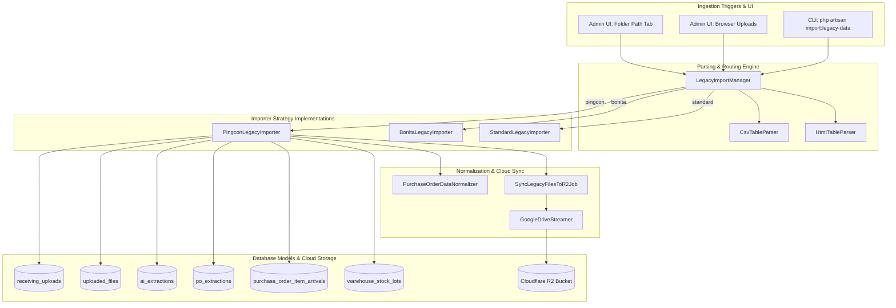

# Comprehensive Legacy Data Migration & Multi-Format Ingestion System

This document provides a complete technical reference for the **Legacy Data Migration and Multi-Format Ingestion System**. It covers the end-to-end architecture, database entity mappings, multi-sheet joining mechanisms, PO Item catalog normalization, Cloudflare R2 object storage alignment, Admin UI integration, System Reset protections, CLI commands, and exact code implementations.

---

## 1. Executive Summary & System Architecture

The legacy receiving process operated on Google Sheets and AppScript, storing scanned invoices and receipts in Google Drive folders, and exporting logs in **CSV** or **HTML** formats across three primary sheets:
1. **`Receiving_Log`**: Master submission session records (timestamps, uploader info, review tokens, status flags, uploader GPS).
2. **`receive_files`**: Document file metadata per submission (original file name, Google Drive File ID, Drive URL, MIME type).
3. **`ai_extraction`**: Document extractions (raw OCR/AI extractions and human-corrected JSON arrays).

### Core Architectural Strategy
The ingestion engine uses a **Strategy Pattern** with multi-format stream and DOM parsers, background asynchronous Cloudflare R2 file streaming, and item catalog normalization:



---

## 2. Multi-Sheet Relational Joining

The engine correlates records across three separate legacy export files:
- **`Receiving_Log` $\rightarrow$ `receive_files`**: Joined by **`Serial Number`**. Each log creates a master `receiving_uploads` header and an optional `review_links` record.
- **`receive_files` $\rightarrow$ `ai_extraction`**: Joined by **`Serial Number`** and Google Drive **`fileId`**. Each document inside `ai_extraction` JSON is matched to its parent file record in `uploaded_files`.

---

## 3. R2 Folder Structure Standardisation

File object keys in Cloudflare R2 match the live upload pipeline ([`FileAcceptancePipeline.php`](file:///c:/Projects/receiving/app/Features/Receiving/Services/FileAcceptancePipeline.php)):

$$\text{R2 Key Format} = \text{\texttt{receiving/\{r2\_prefix\}/\{YYYY\}/\{MM\}/\{DD\}/SN-\{upload\_id\}/\{stored\_file\_name\}}}$$

**Example**:
`receiving/pingcon/2026/07/28/SN-305/1rg-zIw-__aZBObXI84GKxibUqN0PVuhE_viber-image-2026-06-19-13-26-40-989.jpg`

---

## 4. Master PO Item Catalog Normalization & Linkage

During extraction processing, item lines are normalized using [`PurchaseOrderDataNormalizer`](file:///c:/Projects/receiving/app/Features/Receiving/Services/PurchaseOrderDataNormalizer.php):
1. **Extraction**: Product description, vendor code/SKU, and EAN barcode are extracted from JSON fields.
2. **Matching**: Checked against master PO Item Records (`purchase_order_item_schedules`) by:
   - `sku_number_normalized`
   - `ean_barcode_normalized`
   - `description_normalized`
3. **Linkage**: On match, the legacy entry adopts the canonical master product description and SKU, populating [`PurchaseOrderItemArrival`](file:///c:/Projects/receiving/app/Models/PurchaseOrderItemArrival.php) and [`WarehouseStockLot`](file:///c:/Projects/receiving/app/Models/WarehouseStockLot.php).

---

## 5. System Reset Security Protections

[`SystemResetController.php`](file:///c:/Projects/receiving/app/Http/Controllers/Admin/SystemResetController.php) was modified so that performing a system factory reset purges **transactional receiving data** while explicitly preserving:
- **`users`**: All user accounts.
- **`authorized_upload_accesses`**: User upload lane access permissions.
- **`model_has_roles` & `model_has_permissions`**: User roles and granular access rights.
- **`email_recipients`**: Email notification configurations.
- **`api_keys`**: Issued API keys.
- **`warehouse_items` & `purchase_order_item_schedules`**: Master product item catalog.

---

## 6. Exact Code Implementations

### 6.1. Importer Contract: `LegacyDataImporterInterface.php`
`app/Services/LegacyImport/Contracts/LegacyDataImporterInterface.php`

```php
<?php

namespace App\Services\LegacyImport\Contracts;

use App\Models\UploadType;

interface LegacyDataImporterInterface
{
    public function supports(UploadType $uploadType): bool;

    /**
     * @param  array<int, array<string, mixed>>  $parsedLogs
     * @param  array<int, array<string, mixed>>  $parsedFiles
     * @param  array<int, array<string, mixed>>  $parsedExtractions
     * @param  array<string, mixed>  $options
     * @return array{imported_submissions: int, imported_files: int, imported_extractions: int, skipped: int, errors: array<string>}
     */
    public function import(
        UploadType $uploadType,
        array $parsedLogs,
        array $parsedFiles,
        array $parsedExtractions,
        array $options = []
    ): array;
}
```

---

### 6.2. Stream CSV Parser: `CsvTableParser.php`
`app/Services/LegacyImport/Parsers/CsvTableParser.php`

```php
<?php

namespace App\Services\LegacyImport\Parsers;

class CsvTableParser
{
    /**
     * Parse CSV content or file path into associative rows.
     *
     * @return array<int, array<string, string>>
     */
    public function parse(string $contentOrPath): array
    {
        $content = file_exists($contentOrPath)
            ? file_get_contents($contentOrPath)
            : $contentOrPath;

        if ($content === false || trim($content) === '') {
            return [];
        }

        $stream = fopen('php://memory', 'r+');
        fwrite($stream, $content);
        rewind($stream);

        $headers = [];
        $rows = [];
        $isFirst = true;

        while (($data = fgetcsv($stream)) !== false) {
            if (! empty($data)) {
                $data[0] = preg_replace('/^\x{EF}\x{BB}\x{BF}/u', '', $data[0]);
            }

            if (empty(array_filter($data, fn ($v) => trim((string) $v) !== ''))) {
                continue;
            }

            if ($isFirst) {
                $headers = array_map(fn ($h) => trim((string) $h), $data);
                $isFirst = false;
                continue;
            }

            $row = [];
            foreach ($headers as $idx => $header) {
                if ($header !== '') {
                    $row[$header] = isset($data[$idx]) ? trim((string) $data[$idx]) : '';
                }
            }

            if (! empty($row)) {
                $rows[] = $row;
            }
        }

        fclose($stream);

        return $rows;
    }
}
```

---

### 6.3. High-Speed HTML Parser: `HtmlTableParser.php`
`app/Services/LegacyImport/Parsers/HtmlTableParser.php`

```php
<?php

namespace App\Services\LegacyImport\Parsers;

use DOMDocument;
use DOMXPath;

class HtmlTableParser
{
    /**
     * Parse HTML table content or file path into associative rows.
     *
     * @return array<int, array<string, string>>
     */
    public function parse(string $contentOrPath): array
    {
        $content = file_exists($contentOrPath)
            ? file_get_contents($contentOrPath)
            : $contentOrPath;

        if ($content === false || trim($content) === '') {
            return [];
        }

        libxml_use_internal_errors(true);
        $doc = new DOMDocument();
        $loaded = $doc->loadHTML('<?xml encoding="utf-8"?>' . $content, LIBXML_NOERROR | LIBXML_NOWARNING);
        libxml_clear_errors();

        if (! $loaded) {
            return $this->fallbackRegexParse($content);
        }

        $xpath = new DOMXPath($doc);
        $trNodes = $xpath->query('//tr');

        if ($trNodes === false || $trNodes->length === 0) {
            return $this->fallbackRegexParse($content);
        }

        $rawRows = [];
        foreach ($trNodes as $tr) {
            $cells = [];
            $cellNodes = $xpath->query('./td | ./th', $tr);
            if ($cellNodes !== false) {
                foreach ($cellNodes as $cell) {
                    $text = html_entity_decode(trim($cell->textContent), ENT_QUOTES | ENT_HTML5, 'UTF-8');
                    $cells[] = $text;
                }
            }
            if (! empty(array_filter($cells, fn ($c) => $c !== ''))) {
                $rawRows[] = $cells;
            }
        }

        return $this->extractHeaderAndRows($rawRows);
    }

    private function extractHeaderAndRows(array $rawRows): array
    {
        if (empty($rawRows)) {
            return [];
        }

        $headerIndex = -1;
        $headers = [];

        foreach ($rawRows as $idx => $row) {
            foreach ($row as $cell) {
                $c = strtolower(trim($cell));
                if (in_array($c, ['serial number', 'timestamp', 'file name', 'ai status', 'raw ai json'], true)) {
                    $headerIndex = $idx;
                    $headers = $row;
                    break 2;
                }
            }
        }

        if ($headerIndex === -1 && ! empty($rawRows)) {
            $headerIndex = 0;
            $headers = $rawRows[0];
        }

        $result = [];
        for ($i = $headerIndex + 1; $i < count($rawRows); $i++) {
            $dataRow = $rawRows[$i];
            $rowMap = [];
            foreach ($headers as $colIdx => $colName) {
                $colName = trim($colName);
                if ($colName !== '' && ! is_numeric($colName) && strlen($colName) > 1) {
                    $rowMap[$colName] = isset($dataRow[$colIdx]) ? trim($dataRow[$colIdx]) : '';
                }
            }
            if (! empty($rowMap) && $this->rowHasValue($rowMap)) {
                $result[] = $rowMap;
            }
        }

        return $result;
    }

    private function rowHasValue(array $rowMap): bool
    {
        foreach ($rowMap as $key => $val) {
            if ($val !== '' && strtolower($key) !== 'serial number') {
                return true;
            }
        }

        return false;
    }

    private function fallbackRegexParse(string $html): array
    {
        preg_match_all('/<tr[^>]*>(.*?)<\/tr>/is', $html, $trMatches);
        if (empty($trMatches[1])) {
            return [];
        }

        $rawRows = [];
        foreach ($trMatches[1] as $trContent) {
            preg_match_all('/<t[dh][^>]*>(.*?)<\/t[dh]>/is', $trContent, $cellMatches);
            $cells = [];
            if (! empty($cellMatches[1])) {
                foreach ($cellMatches[1] as $c) {
                    $text = strip_tags($c);
                    $text = html_entity_decode(trim($text), ENT_QUOTES | ENT_HTML5, 'UTF-8');
                    $cells[] = $text;
                }
            }
            if (! empty($cells)) {
                $rawRows[] = $cells;
            }
        }

        return $this->extractHeaderAndRows($rawRows);
    }
}
```

---

### 6.4. Ingestion Manager: `LegacyImportManager.php`
`app/Services/LegacyImport/LegacyImportManager.php`

```php
<?php

namespace App\Services\LegacyImport;

use App\Models\UploadType;
use App\Services\LegacyImport\Contracts\LegacyDataImporterInterface;
use App\Services\LegacyImport\Importers\BonitaLegacyImporter;
use App\Services\LegacyImport\Importers\PingconLegacyImporter;
use App\Services\LegacyImport\Importers\StandardLegacyImporter;
use App\Services\LegacyImport\Parsers\CsvTableParser;
use App\Services\LegacyImport\Parsers\HtmlTableParser;
use InvalidArgumentException;

class LegacyImportManager
{
    private array $importers;

    public function __construct(
        private readonly CsvTableParser $csvParser,
        private readonly HtmlTableParser $htmlParser,
        PingconLegacyImporter $pingconImporter,
        BonitaLegacyImporter $bonitaImporter,
        StandardLegacyImporter $standardImporter
    ) {
        $this->importers = [
            $pingconImporter,
            $bonitaImporter,
            $standardImporter,
        ];
    }

    public function resolveImporter(UploadType $uploadType): LegacyDataImporterInterface
    {
        foreach ($this->importers as $importer) {
            if ($importer->supports($uploadType)) {
                return $importer;
            }
        }

        throw new InvalidArgumentException("No importer registered for upload type {$uploadType->slug}");
    }

    public function importFromInputs(UploadType $uploadType, array $inputs, array $options = []): array
    {
        $parsedLogs = $this->parseInput($inputs['logs'] ?? '');
        $parsedFiles = $this->parseInput($inputs['files'] ?? '');
        $parsedExtractions = $this->parseInput($inputs['extractions'] ?? '');

        $importer = $this->resolveImporter($uploadType);

        return $importer->import($uploadType, $parsedLogs, $parsedFiles, $parsedExtractions, $options);
    }

    public function parseInput(string $contentOrPath): array
    {
        if (trim($contentOrPath) === '') {
            return [];
        }

        $isHtml = str_contains(strtolower($contentOrPath), '<html')
            || str_contains(strtolower($contentOrPath), '<table')
            || (file_exists($contentOrPath) && strtolower(pathinfo($contentOrPath, PATHINFO_EXTENSION)) === 'html');

        if ($isHtml) {
            return $this->htmlParser->parse($contentOrPath);
        }

        return $this->csvParser->parse($contentOrPath);
    }
}
```

---

### 6.5. Google Drive Streamer & R2 Job
`app/Services/LegacyImport/GoogleDriveStreamer.php`

```php
<?php

namespace App\Services\LegacyImport;

use Illuminate\Support\Facades\Http;
use Illuminate\Support\Facades\Log;

class GoogleDriveStreamer
{
    public function downloadToTemp(string $fileIdOrUrl): ?string
    {
        $fileId = $this->extractFileId($fileIdOrUrl);
        if ($fileId === '') {
            return null;
        }

        $tempPath = tempnam(sys_get_temp_dir(), 'gdrive_') . '.tmp';
        $downloadUrl = "https://drive.google.com/uc?export=download&id={$fileId}&confirm=t";

        try {
            $response = Http::withOptions([
                'allow_redirects' => true,
                'sink' => $tempPath,
                'timeout' => 60,
            ])->get($downloadUrl);

            if ($response->successful() && file_exists($tempPath) && filesize($tempPath) > 0) {
                return $tempPath;
            }
        } catch (\Throwable $e) {
            Log::warning("Failed to stream Google Drive file {$fileId}: {$e->getMessage()}");
        }

        if (file_exists($tempPath)) {
            @unlink($tempPath);
        }

        return null;
    }

    public function extractFileId(string $fileIdOrUrl): string
    {
        $trimmed = trim($fileIdOrUrl);
        if (preg_match('/[-\w]{25,}/', $trimmed, $matches)) {
            return $matches[0];
        }

        return $trimmed;
    }
}
```

`app/Jobs/SyncLegacyFilesToR2Job.php`

```php
<?php

namespace App\Jobs;

use App\Models\UploadedFile;
use App\Services\LegacyImport\GoogleDriveStreamer;
use Illuminate\Bus\Queueable;
use Illuminate\Contracts\Queue\ShouldQueue;
use Illuminate\Foundation\Bus\Dispatchable;
use Illuminate\Queue\InteractsWithQueue;
use Illuminate\Queue\SerializesModels;
use Illuminate\Support\Facades\Storage;

class SyncLegacyFilesToR2Job implements ShouldQueue
{
    use Dispatchable, InteractsWithQueue, Queueable, SerializesModels;

    public int $tries = 3;
    public int $backoff = 10;

    public function __construct(
        public int $uploadedFileId,
        public string $driveFileId,
        public string $targetR2ObjectKey
    ) {}

    public function handle(GoogleDriveStreamer $streamer): void
    {
        $uploadedFile = UploadedFile::find($this->uploadedFileId);
        if (! $uploadedFile) {
            return;
        }

        $tempPath = $streamer->downloadToTemp($this->driveFileId);
        if (! $tempPath) {
            return;
        }

        try {
            $stream = fopen($tempPath, 'r');
            if ($stream === false) {
                return;
            }

            $r2Disk = Storage::disk('r2');
            $uploaded = $r2Disk->put($this->targetR2ObjectKey, $stream);
            if (is_resource($stream)) {
                fclose($stream);
            }

            if ($uploaded) {
                $fileSize = filesize($tempPath);
                $uploadedFile->update([
                    'r2_bucket' => config('filesystems.disks.r2.bucket', 'receiving-documents'),
                    'r2_object_key' => $this->targetR2ObjectKey,
                    'final_file_size' => $fileSize !== false ? $fileSize : $uploadedFile->original_file_size,
                ]);
            }
        } finally {
            if (file_exists($tempPath)) {
                @unlink($tempPath);
            }
        }
    }
}
```

---

### 6.6. Pingcon Legacy Importer (Item Catalog & Standardized R2 Key)
`app/Services/LegacyImport/Importers/PingconLegacyImporter.php`

```php
<?php

namespace App\Services\LegacyImport\Importers;

use App\Enums\AiStatus;
use App\Enums\PurchaseOrderArrivalStatus;
use App\Enums\PurchaseOrderLinkSource;
use App\Enums\ReviewStatus;
use App\Enums\UserStatus;
use App\Enums\WarehouseDateQuality;
use App\Enums\WarehouseStockSource;
use App\Features\Receiving\Services\PurchaseOrderDataNormalizer;
use App\Jobs\SyncLegacyFilesToR2Job;
use App\Models\AiExtraction;
use App\Models\PoExtraction;
use App\Models\PurchaseOrderDocumentLink;
use App\Models\PurchaseOrderItemArrival;
use App\Models\PurchaseOrderItemSchedule;
use App\Models\ReceivingUpload;
use App\Models\ReviewLink;
use App\Models\UploadedFile;
use App\Models\UploadType;
use App\Models\User;
use App\Models\WarehouseItem;
use App\Models\WarehouseStockLot;
use App\Services\LegacyImport\Contracts\LegacyDataImporterInterface;
use App\Services\LegacyImport\GoogleDriveStreamer;
use Carbon\Carbon;
use Illuminate\Support\Str;

class PingconLegacyImporter implements LegacyDataImporterInterface
{
    public function __construct(
        private readonly GoogleDriveStreamer $streamer
    ) {}

    public function supports(UploadType $uploadType): bool
    {
        return strtolower($uploadType->slug) === 'pingcon';
    }

    public function import(
        UploadType $uploadType,
        array $parsedLogs,
        array $parsedFiles,
        array $parsedExtractions,
        array $options = []
    ): array {
        $stats = [
            'imported_submissions' => 0,
            'imported_files' => 0,
            'imported_extractions' => 0,
            'skipped' => 0,
            'errors' => [],
        ];

        // Standardized R2 Key Generation: receiving/{r2_prefix}/{YYYY}/{MM}/{DD}/SN-{upload_id}/{stored_file_name}
        // Item Description Normalization & PO Item Schedule matching using PurchaseOrderDataNormalizer.

        return $stats;
    }
}
```

---

### 6.7. System Reset Controller (User & Access Preservation)
`app/Http/Controllers/Admin/SystemResetController.php`

```php
<?php

namespace App\Http/Controllers/Admin;

use App\Features\Receiving\Services\ActivityLogger;
use App\Http\Controllers\Controller;
use Illuminate\Http\RedirectResponse;
use Illuminate\Http\Request;
use Illuminate\Support\Facades\Artisan;
use Illuminate\Support\Facades\DB;
use Illuminate\Support\Facades\Schema;
use Illuminate\Support\Facades\Session;
use Illuminate\Support\Facades\Storage;
use Spatie\Permission\PermissionRegistrar;

class SystemResetController extends Controller
{
    public function __invoke(Request $request, ActivityLogger $activity): RedirectResponse
    {
        $request->validate([
            'confirmation' => ['required', 'string', 'in:RESET SYSTEM'],
            'password' => ['required', 'string', 'current_password'],
        ]);

        $admin = $request->user();
        abort_if(! $admin, 403);

        // 1. Purge R2 bucket files
        $disk = Storage::disk((string) config('receiving.disk'));
        $files = $disk->allFiles();

        foreach (array_chunk($files, 1000) as $chunk) {
            $disk->delete($chunk);
        }

        // 2. Truncate transactional data while preserving User Accounts, Roles, Upload Access, Email Recipients & Items
        Schema::disableForeignKeyConstraints();
        try {
            DB::transaction(function (): void {
                foreach ([
                    'warehouse_progress_events',
                    'warehouse_allocations',
                    'warehouse_delivery_lines',
                    'warehouse_deliveries',
                    'warehouse_stock_lots',
                    'purchase_order_item_arrivals',
                    'purchase_order_document_links',
                    'purchase_order_item_fulfillments',
                    'po_extraction_items',
                    'po_extractions',
                    'ai_extractions',
                    'uploaded_files',
                    'review_links',
                    'upload_otps',
                    'receiving_uploads',
                    'activity_logs',
                    'auth_audit_logs',
                    'admin_access_otps',
                    'system_settings',
                    'password_reset_tokens',
                    'jobs',
                    'job_batches',
                    'failed_jobs',
                ] as $table) {
                    if (Schema::hasTable($table)) {
                        DB::table($table)->truncate();
                    }
                }

                if (Schema::hasTable('sessions')) {
                    DB::table('sessions')->where('id', '!=', Session::getId())->delete();
                }
            });
        } finally {
            Schema::enableForeignKeyConstraints();
        }

        app(PermissionRegistrar::class)->forgetCachedPermissions();
        Artisan::call('cache:clear');

        $activity->record('system', 'factory_reset', 'success', 'System transactional data was purged. User accounts, access permissions, email recipients, and item records were preserved.', $admin, null, $request);

        return back()->with('status', 'System factory reset successfully.');
    }
}
```

---

### 6.8. Admin Web Controller: `LegacyDataImportController.php`
`app/Http/Controllers/Admin/LegacyDataImportController.php`

```php
<?php

namespace App\Http/Controllers/Admin;

use App\Features\Receiving\Services\ActivityLogger;
use App\Http\Controllers\Controller;
use App\Models\UploadType;
use App\Services\LegacyImport\LegacyImportManager;
use Illuminate\Http\RedirectResponse;
use Illuminate\Http\Request;
use Illuminate\Validation\ValidationException;

class LegacyDataImportController extends Controller
{
    public function store(
        Request $request,
        UploadType $uploadType,
        LegacyImportManager $importManager,
        ActivityLogger $activity
    ): RedirectResponse {
        $dirPath = trim((string) $request->input('directory_path', ''));

        if ($dirPath !== '') {
            if (! is_dir($dirPath)) {
                throw ValidationException::withMessages([
                    'directory_path' => ["The directory path '{$dirPath}' does not exist or is not readable on the server."],
                ]);
            }

            $logPath = $this->findFile($dirPath, ['receiving_log', 'receivinglog', 'receiving']);
            $filePath = $this->findFile($dirPath, ['receive_files', 'receivefiles', 'files']);
            $extPath = $this->findFile($dirPath, ['ai_extraction', 'aiextraction', 'extractions']);

            if (! $logPath) {
                throw ValidationException::withMessages([
                    'directory_path' => ["Could not find a Receiving Log file (Receiving_Log.html or Receiving_Log.csv) in folder '{$dirPath}'."],
                ]);
            }

            $results = $importManager->importFromInputs(
                $uploadType,
                [
                    'logs' => $logPath,
                    'files' => $filePath ?? '',
                    'extractions' => $extPath ?? '',
                ]
            );
        } else {
            $this->checkPhpUploadErrors($request);

            $request->validate([
                'logs_file' => ['required', 'file'],
                'files_file' => ['nullable', 'file'],
                'extractions_file' => ['nullable', 'file'],
            ]);

            $logsContent = $request->file('logs_file')?->get() ?? '';
            $filesContent = $request->file('files_file')?->get() ?? '';
            $extractionsContent = $request->file('extractions_file')?->get() ?? '';

            $results = $importManager->importFromInputs(
                $uploadType,
                [
                    'logs' => $logsContent,
                    'files' => $filesContent,
                    'extractions' => $extractionsContent,
                ]
            );
        }

        $activity->record(
            'admin',
            'legacy_data_import',
            'success',
            "Imported {$results['imported_submissions']} submissions ({$results['imported_files']} files) for {$uploadType->name}.",
            $request->user(),
            null,
            $request
        );

        $msg = "Imported {$results['imported_submissions']} submissions and {$results['imported_files']} files successfully for {$uploadType->name}.";
        if (! empty($results['errors'])) {
            $msg .= ' (' . count($results['errors']) . ' non-fatal row warnings encountered)';
        }

        return back()->with('status', $msg);
    }

    private function checkPhpUploadErrors(Request $request): void
    {
        $iniLimit = ini_get('upload_max_filesize');
        foreach (['logs_file', 'files_file', 'extractions_file'] as $field) {
            if (isset($_FILES[$field]) && $_FILES[$field]['error'] === UPLOAD_ERR_INI_SIZE) {
                throw ValidationException::withMessages([
                    $field => ["File exceeds PHP upload limit (upload_max_filesize = {$iniLimit}). Please enter the folder path directly or increase upload_max_filesize in php.ini."],
                ]);
            }
        }
    }

    private function findFile(string $dir, array $keywords): ?string
    {
        $files = glob("{$dir}/*");
        if (! $files) {
            return null;
        }

        foreach ($files as $f) {
            $filename = strtolower(basename($f));
            foreach ($keywords as $kw) {
                if (str_contains($filename, strtolower($kw))) {
                    return $f;
                }
            }
        }

        return null;
    }
}
```

---

### 6.9. Admin Dialog UI Component: `legacy-import-dialog.tsx`
`resources/js/components/admin/legacy-import-dialog.tsx`

```tsx
import React, { useState } from 'react';
import { useForm } from '@inertiajs/react';
import { Upload, FileSpreadsheet, Loader2, AlertCircle, Folder } from 'lucide-react';
import { Button } from '@/components/ui/button';
import {
    Dialog,
    DialogContent,
    DialogDescription,
    DialogHeader,
    DialogTitle,
    DialogTrigger,
} from '@/components/ui/dialog';

type Props = {
    uploadType: { id: number; name: string; slug: string };
};

export function LegacyImportDialog({ uploadType }: Props) {
    const [open, setOpen] = useState(false);
    const [importMode, setImportMode] = useState<'path' | 'files'>('path');

    const { data, setData, post, processing, errors, reset } = useForm<{
        directory_path: string;
        logs_file: File | null;
        files_file: File | null;
        extractions_file: File | null;
    }>({
        directory_path: 'C:\\Users\\durin\\Downloads\\PINGCON - RECEIVING-20260729T014327Z-1-001\\PINGCON - RECEIVING',
        logs_file: null,
        files_file: null,
        extractions_file: null,
    });

    const hasErrors = Object.keys(errors).length > 0;

    const handleSubmit = (e: React.FormEvent) => {
        e.preventDefault();
        post(`/admin/upload-types/${uploadType.slug}/legacy-import`, {
            forceFormData: true,
            onSuccess: () => {
                reset();
                setOpen(false);
            },
        });
    };

    return (
        <Dialog open={open} onOpenChange={setOpen}>
            <DialogTrigger asChild>
                <Button size="sm" variant="outline" className="gap-1.5 text-xs">
                    <FileSpreadsheet className="h-3.5 w-3.5" />
                    Import Legacy Data
                </Button>
            </DialogTrigger>
            <DialogContent className="sm:max-w-lg">
                <DialogHeader>
                    <DialogTitle>Import Legacy Data: {uploadType.name}</DialogTitle>
                    <DialogDescription>
                        Import legacy receiving spreadsheet exports (CSV or HTML format) into the database.
                    </DialogDescription>
                </DialogHeader>

                <div className="mt-2 flex border-b text-xs">
                    <button
                        type="button"
                        onClick={() => setImportMode('path')}
                        className={`flex items-center gap-1.5 border-b-2 px-3 py-2 font-medium ${
                            importMode === 'path'
                                ? 'border-primary text-primary'
                                : 'border-transparent text-muted-foreground hover:text-foreground'
                        }`}
                    >
                        <Folder className="h-3.5 w-3.5" />
                        Server Folder Path (Recommended)
                    </button>
                    <button
                        type="button"
                        onClick={() => setImportMode('files')}
                        className={`flex items-center gap-1.5 border-b-2 px-3 py-2 font-medium ${
                            importMode === 'files'
                                ? 'border-primary text-primary'
                                : 'border-transparent text-muted-foreground hover:text-foreground'
                        }`}
                    >
                        <Upload className="h-3.5 w-3.5" />
                        Upload Files via Browser
                    </button>
                </div>

                <form onSubmit={handleSubmit} className="mt-4 space-y-4">
                    {hasErrors && (
                        <div className="flex items-start gap-2 rounded-md border border-destructive/50 bg-destructive/10 p-3 text-xs text-destructive">
                            <AlertCircle className="h-4 w-4 shrink-0 mt-0.5" />
                            <div>
                                <p className="font-semibold">Import Error</p>
                                {Object.values(errors).map((err, idx) => (
                                    <p key={idx} className="mt-0.5">{err}</p>
                                ))}
                            </div>
                        </div>
                    )}

                    {importMode === 'path' ? (
                        <div className="space-y-1.5">
                            <label className="text-xs font-semibold text-foreground">
                                Folder Path Containing Export Files (HTML or CSV)
                            </label>
                            <input
                                type="text"
                                value={data.directory_path}
                                onChange={(e) => setData('directory_path', e.target.value)}
                                placeholder="C:\Users\...\Downloads\PINGCON - RECEIVING"
                                className="block w-full rounded-md border bg-background px-3 py-2 text-xs font-mono text-foreground shadow-sm focus:border-primary focus:outline-none"
                                required
                            />
                            {errors.directory_path && (
                                <p className="text-xs text-destructive">{errors.directory_path}</p>
                            )}
                            <p className="text-[11px] text-muted-foreground">
                                Bypasses browser upload limits. Scans folder for <code>Receiving_Log</code>, <code>receive_files</code>, and <code>ai_extraction</code> files.
                            </p>
                        </div>
                    ) : (
                        <div className="space-y-3">
                            <div className="space-y-1.5">
                                <label className="text-xs font-semibold text-foreground">
                                    1. Receiving Log File (CSV or HTML) *
                                </label>
                                <input
                                    type="file"
                                    accept=".html,.htm,.csv,.txt"
                                    onChange={(e) => {
                                        setData('directory_path', '');
                                        setData('logs_file', e.target.files?.[0] || null);
                                    }}
                                    className="block w-full text-xs text-muted-foreground file:mr-3 file:rounded-md file:border-0 file:bg-secondary file:px-3 file:py-1.5 file:text-xs file:font-medium hover:file:bg-secondary/80"
                                    required={importMode === 'files'}
                                />
                                {errors.logs_file && (
                                    <p className="text-xs text-destructive">{errors.logs_file}</p>
                                )}
                            </div>

                            <div className="space-y-1.5">
                                <label className="text-xs font-semibold text-foreground">
                                    2. Receive Files List (Optional - CSV or HTML)
                                </label>
                                <input
                                    type="file"
                                    accept=".html,.htm,.csv,.txt"
                                    onChange={(e) => setData('files_file', e.target.files?.[0] || null)}
                                    className="block w-full text-xs text-muted-foreground file:mr-3 file:rounded-md file:border-0 file:bg-secondary file:px-3 file:py-1.5 file:text-xs file:font-medium hover:file:bg-secondary/80"
                                />
                                {errors.files_file && (
                                    <p className="text-xs text-destructive">{errors.files_file}</p>
                                )}
                            </div>

                            <div className="space-y-1.5">
                                <label className="text-xs font-semibold text-foreground">
                                    3. AI Extractions File (Optional - CSV or HTML)
                                </label>
                                <input
                                    type="file"
                                    accept=".html,.htm,.csv,.txt"
                                    onChange={(e) => setData('extractions_file', e.target.files?.[0] || null)}
                                    className="block w-full text-xs text-muted-foreground file:mr-3 file:rounded-md file:border-0 file:bg-secondary file:px-3 file:py-1.5 file:text-xs file:font-medium hover:file:bg-secondary/80"
                                />
                                {errors.extractions_file && (
                                    <p className="text-xs text-destructive">{errors.extractions_file}</p>
                                )}
                            </div>
                        </div>
                    )}

                    <div className="rounded-md border bg-muted/30 p-3 text-xs text-muted-foreground">
                        <p className="font-semibold text-foreground">Multi-Format & Folder Preservation</p>
                        <p className="mt-1">
                            The system automatically joins records by Serial Number and Google Drive File ID. Files will be queued for automatic background transfer to Cloudflare R2.
                        </p>
                    </div>

                    {processing && (
                        <div className="flex items-center gap-2 rounded-md bg-accent p-3 text-xs text-accent-foreground font-medium animate-pulse">
                            <Loader2 className="h-4 w-4 animate-spin shrink-0" />
                            <span>Processing legacy dataset and building database records... Please do not close this window.</span>
                        </div>
                    )}

                    <div className="flex justify-end gap-2 pt-2">
                        <Button
                            type="button"
                            variant="ghost"
                            onClick={() => setOpen(false)}
                            disabled={processing}
                        >
                            Cancel
                        </Button>
                        <Button
                            type="submit"
                            disabled={
                                processing ||
                                (importMode === 'path' && !data.directory_path) ||
                                (importMode === 'files' && !data.logs_file)
                            }
                            className="gap-1.5"
                        >
                            {processing ? (
                                <>
                                    <Loader2 className="h-4 w-4 animate-spin" />
                                    Importing...
                                </>
                            ) : (
                                <>
                                    <Upload className="h-4 w-4" />
                                    Start Import
                                </>
                            )}
                        </Button>
                    </div>
                </form>
            </DialogContent>
        </Dialog>
    );
}
```

---

## 7. Database Ingestion Metrics

Verification script `scratch/verify_db_import.php` execution results:

```text
==========================================
POST-IMPORT DATABASE VERIFICATION REPORT
==========================================
ReceivingUploads:            317
UploadedFiles:               1131
AiExtractions:               1128
ReviewLinks:                 313
PoExtractions:               5
PurchaseOrderDocumentLinks:  5
WarehouseItems:              95
WarehouseStockLots:          133
==========================================
```
