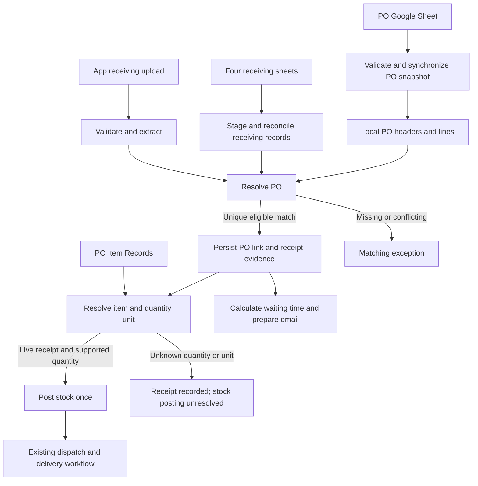

# Purchase Order Sheets and Receiving Transition: Final Implementation Plan

Date: 2026-09-24  
Status: Implementation specification; application changes and migration have not started.  
Audience: Project owner, implementer, and migration operator.  
Workspace: `C:/Projects/Receiving`

This document consolidates the user's latest requirements and supersedes the earlier conversational plans. In particular, **a valid receiving upload confirms receipt automatically; a warehouse operator must not receive the same items a second time**. Existing code and ADRs describe the current system, not authority to override this requirement.

## 1. Outcome and scope

Deliver two coordinated capabilities:

1. Read Purchase Orders from Google Sheets, cross-check extracted receiving documents, persist a reliable PO link, and calculate waiting time before preparing the receiving email. New PO PDF uploads are not required to establish the PO reference.
2. Migrate historical receiving records from A2Z2GO, BONITA, KEYSYS INC., and PINGCON, then allow ongoing Sheets imports and native app uploads together until the owner signals the transition to app-only receiving.

Use the existing Laravel application, database, queue infrastructure, item catalog, and warehouse ledger. Do not introduce another application, a competing PO subsystem, or new dependencies without a demonstrated need.

### Confirmed business requirements

| Requirement | Required behavior |
| --- | --- |
| PO status: In preparation | Draft/preparation data; not an active PO. Exclude from automatic PO linking and active ordered-quantity totals. |
| PO status: Confirmed | An actual PO whose goods have not yet arrived. Eligible for receiving-document matching. |
| PO status: Received | The source reports that goods arrived. Remains eligible for linking supporting receiving documents. |
| Repeated PO number across item rows | Group those rows into one order with multiple lines, subject to validation that their header details agree. |
| Receiving upload | Represents received goods. After successful processing and matching, record receipt automatically; no separate warehouse Receive action. |
| No units in the PO sheet | Cross-check PO Item Records for item identity, units, and package information. Do not invent units. |
| Parallel operation | Continue importing new sheet records while allowing new app records. |
| Final transition | Owner decides when receiving entry moves fully to the app. PO-sheet synchronization continues. |

### Proposed policies requiring confirmation or source evidence

These are not silently approved requirements:

| Decision | Proposed policy | Dependency |
| --- | --- | --- |
| Sheet says Received, without a receiving upload | Record source-reported arrival, but do not create stock from all ordered quantities. | Owner must decide whether sheet status alone proves full quantities received. |
| Waiting-time endpoint | Preserve current behavior: receiving completion date minus PO date, in calendar days. | Confirm if a different business date is intended. |
| Unresolved PO at email time | After bounded transient retries, send the existing notification with matching pending and waiting time unavailable. | Confirm exception policy; do not hold email indefinitely or invent a date. |
| Notification ownership for new legacy-sheet submissions | Preserve a single sender, normally the legacy system while it still sends emails. | Inspect Apps Script and existing email behavior to prevent duplicates. |
| Initial stock during migration | Historical receipts are history only; reconcile today's stock separately. | Current balances, prior shipments, and existing application lots must be inspected. |
| Quantity and unit basis | Treat Amount as the reported quantity, pending source validation; use a catalog unit only when the quantity basis is supported. | A catalog package multiplier alone does not prove whether Amount counts packs or pieces. |
| Complete PO document submitted as receipt evidence | Support the user's receipt intent through the receiving workflow; never confuse reference synchronization with receipt. | Confirm represented quantities/partial receipts in sample documents before automatic stock posting. |

Unresolved decisions block only the affected behavior, not parser development, source preview, or unambiguous PO linking.

## 2. Evidence and current architecture

Repository inspection established the following:

- Laravel 13/PHP backend; React 19, TypeScript, and Inertia frontend.
- Receiving domain services and jobs live under `C:/Projects/Receiving/app/Features/Receiving`.
- Warehouse identity, lots, FIFO allocations, deliveries, and dwell reporting live under `C:/Projects/Receiving/app/Features/Warehouse`.
- Google Sheets staging/import services live under `C:/Projects/Receiving/app/Services/GoogleSheets`.
- A separate CSV/HTML importer lives under `C:/Projects/Receiving/app/Services/LegacyImport`.
- Google access already uses Laravel HTTP requests. R2 stores private document bytes; the database owns operational state.
- Production configuration names PostgreSQL. Existing automated tests use SQLite; relevant migrations and concurrency must also be tested on PostgreSQL.
- The inspected local database has the four source configurations but no receiving/PO records and no configured spreadsheet IDs. It is not evidence of production state.
- Connected Drive discovery did not locate the named source sheets. The actual workbooks, production records, and Apps Script behavior remain unverified.

### Current data paths

**Document ingestion:** authenticated/authorized upload → staging objects → validation and malware scanning → final R2 object → AI extraction → extraction record.

**PO PDFs:** PO extraction → `po_extractions` and `po_extraction_items` → catalog matching → `purchase_order_item_fulfillments` → matching receiving documents and date enrichment.

**Receiving documents:** extraction/review → `purchase_order_document_links` → `purchase_order_item_arrivals` → currently a separate warehouse confirmation → `warehouse_stock_lots` → allocations and customer deliveries.

**Emails:** `FinalizeAiExtraction` already sends the receiving notification after extraction. `ReceivingUploadReceived::emailRows()` already reads the linked PO date and calculates waiting time using `upload_completed_at`, falling back to upload creation time.

**Receiving Sheets:** read `Receiving_Log`, `receive_files`, and `ai_extraction` → staging tables → import by source and serial. A second CSV/HTML path currently writes operational records independently.

### Existing constraints and risks to address

1. PO headers currently require an AI extraction and upload. PO screens and manual candidates assume a PO document exists.
2. Automatic linking selects by normalized PO number and can choose the latest duplicate. Number normalization can also collapse distinct raw identifiers.
3. Item and arrival synchronization delete/recreate rows. That is unsuitable for recurring updates once receipt lines have stock references.
4. The Sheets reader has fixed row caps of 2,000/5,000/2,000; the supplied PO screenshot shows row numbers near 27,900.
5. Imports can overwrite corrected JSON, invent fallback values, and create warehouse stock directly.
6. Imported stock keys differ from normal arrival keys, creating a second path to representing the same goods.
7. File records may be marked available/clean without verifying actual bytes. The transfer helper uses a public Drive download path.
8. Import code can create active users with a fixed password and substitute reviewer identity.
9. Source serials and app IDs are mixed in some lookups and displays. Parallel entry requires distinct source identity.
10. Historical cleanup migrations delete PO records without PO-workflow uploads. Do not rerun or adapt those destructive routines for sheet-owned POs.
11. The current PO Arrived state means at least one linked document, not necessarily complete delivery of all ordered quantities.

## 3. Target data ownership and workflow

| Information | Owner |
| --- | --- |
| PO number/date/supplier/ordered lines/source status | Purchase Orders sheet, preserved as a validated local snapshot |
| Catalog identity, supported base unit/package definitions | PO Item Records and existing warehouse item identity rules |
| Extracted document facts | Receiving document and its extraction |
| Human corrections | App review, with explicit conflict handling for later source changes |
| Receipt evidence and receipt timestamp | Valid app receiving upload or eligible new source receiving record |
| Inventory quantities and allocations | Application warehouse ledger |
| External record identity and synchronization history | Source configuration and import records |

### Status rules

- Preserve raw source status and its normalized meaning separately from app receipt evidence and stock-posting state.
- Confirmed and Received POs are eligible for linking. In preparation is not.
- Unknown, conflicting, or unsupported source statuses are exceptions, not silently interpreted as Confirmed.
- A successful receiving upload can establish receipt while the sheet still says Confirmed. Display the discrepancy; a later synchronization must not undo the receipt.
- Received in the sheet establishes source-reported arrival but does not supply an arrival date or actual received quantities by itself.
- Do not infer full delivery from one receipt, one linked invoice, or one item line. Preserve partial-receipt detail.
- A backward status change or cancellation after receipt does not delete links, lots, or allocations. Record a reconciliation exception.
- Do not write statuses back to Google Sheets in this scope.

## 4. PO source mapping and synchronization

### Provisional mapping from the screenshot

| Column | Target meaning |
| --- | --- |
| Supplier | Supplier display identity; resolve aliases explicitly when needed |
| Type | Source document type; validate eligible purchase-order rows |
| Status | In preparation / Confirmed / Received, kept separate from receipt evidence |
| P.O no. | Raw PO number plus a normalized lookup value |
| Date | Validated PO date |
| Net total / VAT total / Total sum | Header totals, counted once per order |
| Notes | Source notes |
| Code / Name | Source item code and description |
| Amount | Reported quantity; confirm semantics before inventory use |
| Unit price | Signed decimal value with source precision preserved |

Read all relevant columns/tabs before concluding the screenshot is the full schema. Validate header values across each grouped PO. Preserve leading zeros and raw values; never sum repeated header totals.

Classify DISCOUNT and similar rows as financial adjustments. They remain part of order evidence and reconciliation but cannot create catalog fulfillment quantities or stock.

### Identity and complete snapshots

- Use configured workbook/tab identity and a verified PO business key. Repeated rows within one PO are expected; uniqueness across suppliers or years has not been established.
- Do not use row numbers, dates alone, or mutable descriptions as permanent keys.
- Use a stable source line ID when available. If none exists, establish whether an item code is unique within an order. Repeated indistinguishable lines require explicit mapping; do not collapse them or invent a stable key from changing quantities.
- Read bounded chunks with overlap handling for POs crossing chunk boundaries. Never activate a partial order.
- A failed or inconsistent multi-chunk read cannot replace the last successful snapshot. Recheck source revision/consistency where available and restart an inconsistent run.
- Bind apply operations to the inspected snapshot/hash. Changed input requires a new preview rather than applying a different payload invisibly.
- Persist source rows, validation errors, applied changes, and source-to-target mappings with each run.
- Skip unchanged orders. Treat missing source rows as reconciliation events, not deletion instructions.
- Queue synchronization; apply transactions per complete order, avoid overlapping runs for the same source, and retry transient failures with bounded backoff.

Matching normally uses the last successful local PO snapshot. Perform bounded refresh/retry for missing or stale references before email finalization; define freshness policy from actual source update frequency. Display synchronization freshness and failures. Do not make every item lookup a separate Google request.

## 5. PO matching, catalog resolution, and receipt posting

### One shared PO resolver

Use the same resolver for AI completion, receiving imports, review corrections, manual selection, and newly synchronized POs.

1. Preserve the extracted PO number and compare its normalized value against eligible orders.
2. Automatically select only a unique eligible order without contradictory supplier evidence.
3. If the number is absent, use supplier and item evidence to propose candidates. Similar product lists do not prove order identity.
4. If several candidates, identifier collisions, or supplier conflicts exist, request confirmation in the app.
5. Persist the selected PO ID, source version, match method, and actor where applicable.
6. Retry only affected unmatched documents when relevant PO data arrives.

Preserve the current one-active-PO-per-extraction contract. An upload may contain several files linked to different POs. A single extraction referencing several POs is an exception unless a separately approved split is introduced.

A PO document intentionally submitted through the receiving flow may serve as receipt evidence under the user's rule. Add that eligibility explicitly to the receiving resolver; do not fabricate invoice data or make every PO reference import create a receipt. Keep legacy reference-only PO uploads distinguishable.

### Catalog and unit resolution

- Prefer exact item code/SKU, then exact barcode where available, then a unique description match.
- Reuse the current normalizers, but add an explicit ambiguity outcome instead of selecting the highest-scoring candidate regardless of ties.
- Resolve to an existing PO Item Record and warehouse item; do not invent duplicate catalog items on every import.
- Record the source of the selected unit and any conversion. A matching catalog SKU does not automatically prove whether Amount counts pieces, cases, or packs.
- Preserve the original reported quantity and unit separately from any normalized base quantity.
- Unknown units do not block PO linkage, receipt evidence, or waiting-time email fields. They block unsupported shortage/overage calculations and stock posting.
- A known receiving-document unit may support stock posting even if the ordered quantity's unit remains unknown. In that case, order-versus-receipt comparison remains unavailable.

### Automatic receipt and stock

For a valid live receiving upload:

1. Persist receipt evidence when the PO match is established. Do not require another warehouse Receive action.
2. Resolve each represented product line and actual received quantity.
3. Post eligible stock through a shared receipt service, in a transaction, using a stable receipt-line source key and a database uniqueness constraint.
4. Record automatic posting, original uploader/source, processing actor, quantity/unit provenance, and event time. Do not impersonate a warehouse operator.
5. Use original receiving completion time, not queue execution time. This becomes the placement timestamp under the new business rule; document the resulting change in dwell semantics.
6. Keep unresolved items visible as receipt/data exceptions. Resolving a mapping may complete posting without asking someone to physically receive the goods again.

Unchanged retries are no-ops. Freeze the applied receipt-line identity and payload version. Reordered or corrected extraction lines must not silently reuse a line-position key for a different product. Once posted, quantity/item changes require an explicit correction workflow; do not overwrite a lot or recalculate existing allocations. If correction tooling is outside this release, block such mutations with an actionable explanation.

Unlinking, deleting, reprocessing, or changing a document with posted stock must use the same guard. Protect this boundary in services, not only the UI.

Do not grant uploaders general warehouse-management permissions. The automatic service executes only the authorized receipt transition; dispatch, opening balance, and delivery permissions remain separate.

## 6. Email and waiting-time integration

Preserve the existing sequence while introducing a durable matching outcome before notification:

**Validate → extract → resolve PO → persist link/receipt result → prepare waiting-time fields → send.**

- Calculate each document's waiting time from the linked PO date and original receiving completion date, using calendar dates in one configured business timezone.
- Use the linked sheet PO as the source of the email PO date; display conflicts with reviewed document values rather than silently rewriting original evidence.
- Same-day receipt is zero days. A receiving date before the PO date is a date conflict, not a negative or absolute waiting time.
- Missing match/date produces an explicit unavailable/pending result, not zero.
- Unit exceptions do not prevent date-based waiting time.
- Historical imports do not resend notifications or reactivate old review links.
- New legacy-source records follow the agreed notification owner; app-created records use existing app recipients and review flow.
- A later match updates the app. Existing manual resend remains available; do not silently send another original notification.
- Scope retries to the matching/notification state. Stock retries cannot resend email or re-extract files. Preserve the existing sent guard and audit uncertain send outcomes instead of claiming exactly-once email delivery.

Retain raw extracted and human-corrected data. Linked PO metadata and provenance must be explicit; source enrichment must not erase what the document actually contained.

## 7. Receiving migration and parallel operation

### Priority repair: restore automatic webhook ingestion for all four sources

The owner reports that new uploads in the legacy Google Sheets do not automatically appear in the app. Repairing this existing integration is an explicit acceptance requirement, not merely a future synchronization enhancement. No running webhook or Apps Script has been changed by writing this plan.

Confirmed repository findings:

- The generated Apps Script in `C:/Projects/Receiving/resources/js/pages/admin/sheets-sync/components/sheet-settings-modal.tsx` defines `onNewUploadRow(e)` but calls `sendNewUploadWebhook()` without the new record's serial. The sender substitutes `serial_number: 1`. If this generated version is installed, events target serial 1 rather than the actual new upload.
- The generated snippet does not install a trigger or connect itself to the upload-writing function. A custom function name alone does not register an automatic event handler.
- The settings UI posts to `/admin/sheets-sync/config/{slug}` and omits `slug` in its body, while the backend defines `/admin/sheets-sync/config` and validates a required body `slug`. The UI also swallows caught errors. Configuration persistence can therefore fail without useful feedback.
- The current webhook can return success after staging/refreshing alone. Operational import additionally requires a positive serial and `auto_sync_on_webhook`; an HTTP success or successful Apps Script execution does not prove that a receiving record was created.
- The current ping path reads all three source tabs synchronously using fixed row limits. It can miss later rows or run before related files/extraction data is complete.

These are verified code defects/limitations, not a verified explanation of the installed production scripts. Inspect each installed script and one failed/missing event before claiming the production root cause.

Google documents that spreadsheet changes made by script executions/API requests do not cause edit/change triggers to execute. If the legacy upload handler writes the rows programmatically, invoke the webhook sender explicitly from that handler after the relevant writes complete. An installed edit trigger may additionally cover genuine manual edits; do not depend on it for programmatic uploads. Sources: [Installable trigger restrictions](https://developers.google.com/apps-script/guides/triggers/installable#restrictions), [Simple trigger restrictions](https://developers.google.com/apps-script/guides/triggers#restrictions).

Repair sequence:

1. For each of `a2z2go`, `bonita`, `keysys`, and `pingcon`, verify the deployed HTTPS endpoint, configured source workbook, exact source slug, matching secret, auto-sync setting, and installed script/trigger account. Do not print secrets or regenerate them without coordinating the sender.
2. Correct the settings route/payload contract, optional-field handling, and visible save/error feedback. Verify saved values by readback.
3. Integrate a shared sender with each source's actual upload-writing workflow. Send the real serial plus event identity and source version; never default to serial 1, infer the current upload from the last row under concurrency, or post to a localhost URL copied from development.
4. Distinguish submission creation, extraction completion, and correction events. A receiving record may become visible while extraction is pending, but incomplete data must not be marked fully processed or create stock. Later events complete the same source record.
5. Authenticate and durably record a validated event, then acknowledge it as accepted/queued with a correlation ID. Queue processing through the common importer. Report imported, pending-data, failed, and already-processed outcomes separately. Define new response fields additively and check the installed sender before changing existing response expectations.
6. Validate required serials and consistency across log/file/extraction payloads. Make retries, duplicate events, and out-of-order events safe; do not apply older data over newer reviewed results.
7. Make the sender inspect HTTP status and response outcome. Retry transient failures with a bounded persisted retry mechanism; surface authorization/schema failures for correction instead of only logging a nominal execution success. Add bounded reconciliation for missed events, with an explicit configured schedule; this document does not create an automation.
8. Trace event receipt → staged source record → processing result → receiving upload ID → displayed app record. Add source-specific last-event time, processing status, and actionable errors to integration diagnostics. Verify browser refresh separately from database ingestion.
9. Repair incomplete/missed submissions through a previewed backfill using stable source identity. Do not re-import all historical records blindly or enable the current unsafe historical-stock side effects merely to make rows appear.

The actual `.gs` projects are external and have not been supplied. Obtain their source or read access, current installed-trigger configuration, and redacted execution HTTP status/body. Prepare reviewed patches for each verified project; replacing a generated snippet inside the app does not update already installed scripts.

Completion gate: perform an authorized end-to-end test for **each of the four sources**, using the real upload workflow and a serial other than 1. The correct record must appear in receiving logs without pressing Refresh Sheet, Sync Serial, or Batch Sync. A duplicate event must create no additional upload or stock; an extraction-completed event must update that same record. Failed processing must be visible rather than represented as a successful import. Until those checks pass, do not call the webhook integration fixed.

### One import path

Route connected Sheets, webhook inputs, and supported CSV/HTML exports through common staging, validation, and persistence rules. Avoid a second implementation of user creation, PO linking, receipt posting, or file acceptance.

Use durable external identity: source configuration/workbook plus original serial, and external file ID for each document. File names are controlled fallback evidence, not the preferred key. Reconcile imports already created by either legacy path before inserting new records.

### Numbering and duplicate entry

- Store the original source serial independently from the app serial and internal primary key.
- Allocate app serials safely under concurrency. Do not let two active systems compete for one counter.
- Backfill existing source identity only from evidence; do not silently renumber public records.
- Detect existing numbering collisions before adding uniqueness constraints.
- Label source serial and app serial distinctly in affected views, emails, and exports.
- Add a compatible explicit source/lane filter to API lookups. Preserve existing fields and document old unqualified lookup semantics while consumers migrate.
- Flag likely duplicate submissions entered in both systems. Same PO alone is never sufficient because multiple receipts against one PO are valid.
- A repeat import of the same external record must not create another upload, extraction, receipt, or lot.

### Historical versus live records

Define a per-source baseline manifest before ongoing imports begin. Classification must survive retries and late edits; a changed timestamp or a serial below the latest value does not automatically make a record new or historical.

- Historical receiving data is imported as historical evidence, with original dates and review provenance.
- Do not convert all historical receipts into available stock or put them in a new-receipt queue.
- Reconcile existing lots, opening balances, shipments, and allocations before importing any current inventory.
- New eligible source submissions during parallel operation use the same automatic receipt rules as app uploads.
- Later source changes never silently overwrite app-reviewed corrections. Stage conflicts for resolution.
- Preserve missing values as unknown; do not invent quantities, receiving dates, uploader identity, or reviewer identity.
- Do not create active login accounts or fixed passwords from imported names/emails. Use existing mappings or a non-login import identity, with original attribution retained separately.

### Attachment migration

Verify existing R2 objects and retain verified keys. Otherwise transfer using authenticated Drive access where required, then reuse the established validation/scanning boundary before exposing bytes. Do not accept login HTML as a PDF or mark a file clean solely from source metadata.

Persist pending, available, missing, and failed transfer outcomes; record actual size/hash where appropriate. Dispatch transfers after database commit, with bounded retries and cleanup of temporary files. Keep originals until reconciliation; never delete source Drive files as part of this migration.

### Transition modes

| Mode | Behavior |
| --- | --- |
| Parallel | App uploads and new sheet imports are accepted. |
| Reconciliation | Capture final source changes; resolve pending jobs, files, duplicates, and conflicts. |
| App-only | App is the new receiving entry point. Late sheet changes are staged as exceptions, not silently applied. |

Modes are per receiving source. Bind in-flight jobs to the mode/version and recheck before applying, so stale webhooks cannot bypass cutover. PO-sheet synchronization remains enabled independently.

## 8. Database change design

Keep existing table names and IDs wherever possible. Add migrations rather than modifying historical migrations. Exact constraints depend on source profiling and existing production duplicates.

| Table | Planned additions/changes |
| --- | --- |
| `po_extractions` | Optional document/upload ownership; source kind and identity; raw/normalized sheet status; notes; source hash/version and sync timestamps. Preserve existing PO links. |
| `po_extraction_items` | Stable source-line mapping, product/adjustment classification, source quantity/unit and mapping provenance. Preserve referenced item IDs. |
| `purchase_order_item_fulfillments` | Optional PO upload reference; only comparable, supported quantities participate in existing target calculations. |
| `google_sheet_configs` | Source kind, tab/range mapping, transition mode/version, baseline and last successful snapshot metadata. |
| `google_sheet_sync_jobs` | Run kind, snapshot identity, durable processing state, partial-failure result, source-scoped progress. |
| New `google_sheet_sync_records` | Per-source-record snapshot/hash, validation, target mappings, before/after change evidence, and retry outcome. Restrict access to sensitive payloads. |
| `receiving_uploads` | External identity/serial, baseline classification, import provenance; safe app serial allocation. |
| `uploaded_files` | External document identity and durable attachment migration state. |
| `purchase_order_item_arrivals` | Stable receipt identity/version, original quantity/unit, mapping outcome, stock-posting state and provenance. Avoid delete/recreate synchronization. |
| `warehouse_stock_lots` | Automatic/manual/import provenance as necessary; retain stable source-key uniqueness and existing allocation references. |

Define foreign-key deletion behavior explicitly. A sheet-owned PO must survive deletion of a formerly associated PDF. Existing PDF-only behavior should remain covered by regression tests. Catalog deletion or unit edits must not rewrite already posted quantities.

Reconcile old `GSHEET-STOCK-*` lots against receipt source keys before enabling automatic posting. If an old lot already has allocations, preserve it and map its provenance rather than deleting/recreating it. Ambiguous legacy mappings are blocking exceptions for the affected receipts.

## 9. Exact implementation file plan

Paths below are rooted at `C:/Projects/Receiving`. Existing files are modification targets; new files are proposals and are not present merely because this plan names them. Keep each change limited to its stated responsibility.

### Existing backend files

| File(s) | Purpose |
| --- | --- |
| `C:/Projects/Receiving/app/Services/GoogleSheets/GoogleSheetsApiService.php` | Complete bounded reads, typed value/date handling, transient retries, and clear authentication failures. Validate existing token construction against provider requirements. |
| `C:/Projects/Receiving/app/Services/GoogleSheets/GoogleSheetsDataSyncService.php` | Common repeat-safe receiving importer, provenance, correction conflicts, baseline classification, and queued run coordination. Remove direct ad hoc stock creation. |
| `C:/Projects/Receiving/app/Services/GoogleSheets/GoogleSheetsTableParser.php` | Strict header/schema validation and supported multiline CSV handling. |
| `C:/Projects/Receiving/app/Services/LegacyImport/LegacyImportManager.php`; `C:/Projects/Receiving/app/Services/LegacyImport/Importers/PingconLegacyImporter.php` | Route exported data into the common pipeline; preserve wrapper compatibility for other lanes. |
| `C:/Projects/Receiving/app/Services/LegacyImport/GoogleDriveStreamer.php`; `C:/Projects/Receiving/app/Jobs/SyncLegacyFilesToR2Job.php`; `C:/Projects/Receiving/app/Console/Commands/SyncLegacyR2Command.php` | Authenticated, validated, resumable file transfer and accurate outcomes. |
| `C:/Projects/Receiving/app/Models/GoogleSheetConfig.php`; `C:/Projects/Receiving/app/Models/GoogleSheetSyncJob.php`; `C:/Projects/Receiving/app/Models/GoogleSheetLog.php`; `C:/Projects/Receiving/app/Models/GoogleSheetFile.php` | Source configuration, run state, stable staging identity, and relationships. |
| `C:/Projects/Receiving/app/Models/PoExtraction.php`; `C:/Projects/Receiving/app/Models/PoExtractionItem.php`; `C:/Projects/Receiving/app/Models/PurchaseOrderItemFulfillment.php` | Optional document relationships, source ownership, and item mapping. |
| `C:/Projects/Receiving/app/Models/ReceivingUpload.php`; `C:/Projects/Receiving/app/Models/UploadedFile.php`; `C:/Projects/Receiving/app/Models/PurchaseOrderItemArrival.php`; `C:/Projects/Receiving/app/Models/WarehouseStockLot.php` | Import identity, history classification, receipt state, and automatic-posting provenance. |
| `C:/Projects/Receiving/app/Features/Receiving/Actions/InitiateReceivingUpload.php`; `C:/Projects/Receiving/app/Features/Receiving/Services/UploadSerialNumber.php` | Concurrency-safe app numbering and distinct source serial display/lookup. |
| `C:/Projects/Receiving/app/Features/Receiving/Services/PoExtractionStore.php` | Preserve PDF compatibility while preventing PDF reprocessing from overwriting sheet-owned POs. |
| `C:/Projects/Receiving/app/Features/Receiving/Services/PurchaseOrderLinker.php`; `C:/Projects/Receiving/app/Features/Receiving/Services/PurchaseOrderDataIntegrator.php`; `C:/Projects/Receiving/app/Features/Receiving/Services/PurchaseOrderItemMatcher.php` | Shared resolver use, safe field enrichment, non-destructive arrival updates, ambiguity and unit handling. |
| `C:/Projects/Receiving/app/Features/Receiving/Jobs/ExtractReceivingBatch.php`; `C:/Projects/Receiving/app/Features/Receiving/Jobs/FinalizeAiExtraction.php` | Match/link/receipt sequence and durable notification readiness. |
| `C:/Projects/Receiving/app/Features/Receiving/Services/UploadNotificationSender.php`; `C:/Projects/Receiving/app/Mail/ReceivingUploadReceived.php`; `C:/Projects/Receiving/app/Mail/ReceivingReviewReady.php` | Waiting-time source, pending/conflict display data, notification ownership, and source-aware serial labels. |
| `C:/Projects/Receiving/app/Features/Warehouse/Services/WarehouseOperations.php`; `C:/Projects/Receiving/app/Features/Warehouse/Services/WarehouseItemResolver.php` | Extract/reuse receipt posting, remove duplicate confirmation requirements for new receipts, and enforce supported item units. Preserve dispatch/FIFO algorithms. |
| `C:/Projects/Receiving/app/Features/Receiving/Services/DeleteReceivingUploadService.php`; `C:/Projects/Receiving/app/Features/Receiving/Services/ReceivingUploadReprocessor.php` | Protect posted receipt evidence, lots, and sheet-owned POs from destructive changes. |
| `C:/Projects/Receiving/app/Http/Controllers/Receiving/ReviewController.php`; `C:/Projects/Receiving/app/Http/Controllers/Receiving/UploadPageController.php` | Route review/history edits through posted-receipt correction guards; consistent serial display. |
| `C:/Projects/Receiving/app/Http/Controllers/Admin/GoogleSheetSyncController.php`; `C:/Projects/Receiving/app/Http/Controllers/Api/GoogleSheetWebhookController.php`; `C:/Projects/Receiving/app/Console/Commands/GoogleSheetSyncCommand.php` | Validated asynchronous imports, required webhook secrets, run-specific progress/cancellation, and transition enforcement. |
| `C:/Projects/Receiving/app/Http/Controllers/Receiving/UploadRecordController.php`; `C:/Projects/Receiving/app/Http/Controllers/Admin/UploadLogController.php`; `C:/Projects/Receiving/app/Http/Controllers/Admin/PurchaseOrderDocumentLinkController.php`; `C:/Projects/Receiving/app/Http/Controllers/Admin/PurchaseOrderReportController.php` | Source-aware PO details/search, safe manual links, effective status, catalog/quantity uncertainty, and report provenance. |
| `C:/Projects/Receiving/app/Http/Controllers/Warehouse/WarehouseArrivalsController.php`; `C:/Projects/Receiving/app/Http/Controllers/Warehouse/WarehouseOperationsController.php` | Show automatic receipts and exceptions; prevent a second confirmation path. |
| `C:/Projects/Receiving/app/Http/Controllers/Api/V1/CorrectedDataController.php`; `C:/Projects/Receiving/app/Http/Requests/Api/SerialCorrectedDataRequest.php` | Add compatible source-qualified lookup; retain established corrected-data response fields. |
| `C:/Projects/Receiving/app/Http/Controllers/Admin/SystemResetController.php` | Account for added tables and metadata without expanding destructive reset behavior. Reset is not a migration/rollback tool. |
| `C:/Projects/Receiving/app/Enums/PurchaseOrderLinkStatus.php` | Explicit ambiguity/conflict outcomes with corresponding frontend handling. |

### Existing UI, routing, and configuration files

| File(s) | Purpose |
| --- | --- |
| `C:/Projects/Receiving/resources/js/pages/admin/purchase-orders/index.tsx` | PO-record list independent of uploaded files; source/effective status and sync freshness. |
| `C:/Projects/Receiving/resources/js/pages/admin/uploads/index.tsx`; `C:/Projects/Receiving/resources/js/pages/upload/detail.tsx` | Source serials, match exceptions, automatic receipt state, and valid PO detail links. |
| `C:/Projects/Receiving/resources/js/pages/admin/purchase-orders/reports/ordered-items.tsx`; `C:/Projects/Receiving/resources/js/pages/admin/purchase-orders/reports/missing-items.tsx` | Nullable upload references, sheet provenance, and unavailable quantity comparisons. |
| `C:/Projects/Receiving/resources/js/pages/admin/sheets-sync/index.tsx`; `C:/Projects/Receiving/resources/js/pages/admin/sheets-sync/components/sheet-settings-modal.tsx`; `C:/Projects/Receiving/resources/js/pages/admin/sheets-sync/components/batch-sync-modal.tsx`; `C:/Projects/Receiving/resources/js/pages/admin/sheets-sync/components/serial-details-modal.tsx` | Source mapping, preview/apply, conflicts, attachment state, progress, and transition controls. |
| `C:/Projects/Receiving/resources/js/pages/warehouse/arrivals.tsx`; `C:/Projects/Receiving/resources/js/pages/warehouse/types.ts`; `C:/Projects/Receiving/resources/js/components/receiving/status-badge.tsx` | Automatic-receipt presentation and exception states; no duplicate routine Receive action. |
| `C:/Projects/Receiving/resources/views/mail/receiving/partials/ai-table.blade.php`; `C:/Projects/Receiving/resources/views/mail/receiving/upload-received-text.blade.php` | Matching/receiving date and waiting-time states in HTML and text emails. |
| `C:/Projects/Receiving/routes/web.php`; `C:/Projects/Receiving/routes/console.php`; `C:/Projects/Receiving/config/services.php`; `C:/Projects/Receiving/config/receiving.php`; `C:/Projects/Receiving/.env.example` | Protected PO/search/sync routes, configurable source/freshness behavior, rollout controls, and scheduling. Do not put secrets in committed files. |

### New files

| Proposed file | Purpose |
| --- | --- |
| `C:/Projects/Receiving/app/Services/GoogleSheets/PurchaseOrderSheetParser.php` | Deterministic PO row mapping and grouped-order validation. |
| `C:/Projects/Receiving/app/Services/GoogleSheets/PurchaseOrderSheetSyncService.php` | Stage, preview, reconcile, and apply PO snapshots. |
| `C:/Projects/Receiving/app/Features/Receiving/Services/PurchaseOrderResolver.php` | Shared PO selection and explicit ambiguity outcomes. |
| `C:/Projects/Receiving/app/Features/Receiving/Services/ReceivingItemResolver.php` | Shared catalog identity and quantity-unit resolution, reusing existing normalizers. |
| `C:/Projects/Receiving/app/Features/Warehouse/Services/ReceiptPostingService.php` | Atomic, repeat-safe automatic stock posting and posted-receipt guards. |
| `C:/Projects/Receiving/app/Jobs/SyncPurchaseOrderSheet.php`; `C:/Projects/Receiving/app/Jobs/SyncReceivingSheetBatch.php` | Durable bounded background work and resumable progress. |
| `C:/Projects/Receiving/app/Models/GoogleSheetSyncRecord.php` | Per-record synchronization evidence and mappings. |
| `C:/Projects/Receiving/app/Http/Controllers/Admin/PurchaseOrderController.php`; `C:/Projects/Receiving/app/Http/Requests/Admin/SyncGoogleSheetRequest.php` | PO list/detail/search and validated synchronization input. |
| `C:/Projects/Receiving/app/Enums/PurchaseOrderSourceStatus.php`; `C:/Projects/Receiving/app/Enums/ReceiptPostingStatus.php`; `C:/Projects/Receiving/app/Enums/ReceivingSourceMode.php` | Separate source, stock-posting, and transition states. |
| `C:/Projects/Receiving/resources/js/pages/admin/purchase-orders/show.tsx` | PO header/lines, provenance, receipt evidence, and exceptions without a required PDF. |
| `C:/Projects/Receiving/database/migrations/2026_09_24_000001_add_purchase_order_sheet_sources.php` | PO ownership, source metadata, stable line references, and optional fulfillment upload. |
| `C:/Projects/Receiving/database/migrations/2026_09_24_000002_add_receiving_source_identity.php` | External identity and history classification; only validated uniqueness constraints. |
| `C:/Projects/Receiving/database/migrations/2026_09_24_000003_add_receipt_posting_metadata.php` | Stable receipt and automatic posting provenance. |
| `C:/Projects/Receiving/database/migrations/2026_09_24_000004_extend_google_sheet_sync_tracking.php` | Source mapping/modes, run metadata, and per-record evidence. |

Migration filenames are reserved proposals; adjust timestamps to actual migration ordering when implementation begins. Data reconciliation/backfill runs are separate resumable operations, not network calls inside schema migrations.

### Existing areas to preserve

- Authentication, OTP, API key security, and broad role definitions. Add only necessary checks on new/changed operations; do not broaden uploader warehouse permissions.
- Normal malware scanning and file-acceptance behavior. Reuse it for imported files without weakening it.
- Ordinary invoice/receipt AI extraction prompts unless a demonstrated input contract change requires a small adjustment.
- Driver delivery behavior, dispatch transactions, FIFO selection, and historical allocation records.
- Master catalog data, unrelated settings, design-system primitives, dependency versions, and generated route files.
- Historical migration contents. Do not remove legacy PDF evidence or delete old source sheets.

Conditional small updates to dashboard counts/navigation or other serializers are allowed only if dependency tests show they assume manual receiving or a PO upload. Record the exact additional file and reason before editing it.

## 10. Implementation sequence and acceptance gates

### Phase 0 — Source and production inventory

Read the five workbooks, relevant Apps Script behavior, and production schema/data counts. Establish status values, identity rules, quantity semantics, source ownership, existing imports, and stock provenance. Obtain a verified backup/restore procedure before migration.

Gate: source mapping and record identity are evidenced; unresolved policies are explicit. No production data writes.

### Phase 0A — Diagnose and prepare the four-source webhook repair

Trace the reported missing uploads using the webhook repair sequence in Section 7. Correct the local sender template/settings contract and prepare source-specific Apps Script changes as a bounded first implementation increment. First verify with provider fakes and a safe test environment. Reuse the planned durable importer/event tracking; do not introduce a second temporary sync path.

Gate: exact failure evidence is recorded for each source, sender and receiver contracts agree, and repeat/partial-event tests pass. Activating operational imports in production also depends on the identity, history-classification, and receipt safeguards below. Remote script changes and production validation are separate rollout actions; a local code fix alone is not completion.

### Phase 1 — Additive schema and preview

Add source/provenance structures and a PO parser. Build read/validate/preview with counts for new, unchanged, changed, invalid, and conflicting records. Reconcile existing PDF POs and old receiving imports without automatically merging ambiguous records.

Gate: complete grouped POs, correct repeated totals, correct status eligibility, adjustment classification, and no operational mutation from preview.

### Phase 2 — PO linking and email vertical slice

Implement snapshot application, shared resolution, source-aware PO pages, and match-before-email sequencing. Keep PDF-only records compatible. Do not activate automatic stock for real records until Phase 3 passes.

Gate: a new receiving upload links to a Confirmed or Received sheet PO without a PO PDF and produces the correct waiting-time email. In preparation and ambiguous orders do not auto-link.

### Phase 3 — Automatic receipt and catalog mapping

Implement receipt evidence, catalog resolution, one posting service, stable line identity, and guards on edits/unlinks/deletes/reprocessing. Update warehouse screens and remove the second Receive requirement for the new workflow. Reconcile any already-existing lots before activating automatic posting.

Gate: one supported live receiving event produces one stock entry, zero additional confirmation actions, and repeat processing produces no additional stock. Unit exceptions do not block valid waiting-time emails.

### Phase 4 — Historical migration

Harden the common importer and attachment transfers. Pilot representative records on a production-like copy, then migrate one source at a time in resumable batches. Import PO references before linking receiving history.

Gate: counts, files, dates, corrections, and links reconcile; re-import is a no-op; available inventory and allocated history remain unchanged unless a separate inventory reconciliation is approved.

### Phase 5 — Parallel operation

Enable new sheet submissions and app uploads together. Enforce numbering/source identity, source-owned edits, conflict handling, receipt idempotency, notification ownership, and queue isolation/bounds.

Gate: equivalent receipts through either entry point behave consistently; cross-entry duplicates are visible; no double stock or duplicate app-triggered notification from retries.

### Phase 6 — Owner-directed cutover

On the owner's signal, reconcile the final source snapshot and pending work, change each receiving source to app-only, and stage late source events as exceptions. Continue PO synchronization.

Gate: no unaccounted pending receiving imports; source history remains accessible; app receiving remains uninterrupted.

## 11. Verification plan

Do not treat source inspection or a passing SQLite suite as proof of production correctness. Use provider fakes for deterministic tests, real PostgreSQL for schema/concurrency checks, and a reconciled source sample for mapping acceptance.

### New focused tests

- `C:/Projects/Receiving/tests/Unit/GoogleSheets/PurchaseOrderSheetParserTest.php`
- `C:/Projects/Receiving/tests/Feature/Receiving/PurchaseOrderSheetSyncTest.php`
- `C:/Projects/Receiving/tests/Feature/Receiving/ReceivingMigrationReconciliationTest.php`
- `C:/Projects/Receiving/tests/Feature/Receiving/ReceivingSourceTransitionTest.php`
- `C:/Projects/Receiving/tests/Feature/Receiving/GoogleSheetWebhookIngestionTest.php`
- `C:/Projects/Receiving/tests/Feature/Warehouse/AutomaticReceiptPostingTest.php`

### Existing tests to extend or run

- `C:/Projects/Receiving/tests/Feature/GoogleSheetSyncTest.php`
- `C:/Projects/Receiving/tests/Feature/Receiving/PurchaseOrderLinkingTest.php`
- `C:/Projects/Receiving/tests/Feature/Receiving/PurchaseOrderItemReportingTest.php`
- `C:/Projects/Receiving/tests/Feature/Receiving/UploadNotificationTest.php`
- `C:/Projects/Receiving/tests/Feature/Receiving/ReceivingWorkflowTest.php`
- `C:/Projects/Receiving/tests/Feature/Receiving/ReviewFlowTest.php`
- `C:/Projects/Receiving/tests/Feature/Receiving/UploadHistoryEditTest.php`
- `C:/Projects/Receiving/tests/Feature/Receiving/DeleteReceivingUploadTest.php`
- `C:/Projects/Receiving/tests/Feature/Receiving/SystemResetTest.php`
- `C:/Projects/Receiving/tests/Feature/Receiving/UploadInitiationTest.php`
- `C:/Projects/Receiving/tests/Feature/Api/CorrectedDataApiTest.php`
- `C:/Projects/Receiving/tests/Feature/Warehouse/WarehouseDwellWorkflowTest.php`
- `C:/Projects/Receiving/tests/Feature/Warehouse/WarehouseBulkPoConfirmationTest.php`

Existing tests that assert manual confirmation or automatic historical stock must be updated to the explicitly changed business rules, not removed merely to obtain a pass.

| Scenario | Expected evidence |
| --- | --- |
| Preparation → Confirmed → Received | Correct eligibility and preserved independent receipt evidence. |
| Sheet PO without PDF | List/detail/report/link/email all work with null document ownership. |
| Repeated header totals, discounts, leading zeros | One header total, preserved identifiers, no adjustment stock. |
| PO crosses read chunks or fetch fails midway | No partial PO activation; prior snapshot retained. |
| Duplicate PO identity or contradictory supplier | No automatic selection; explicit exception. |
| Missing PO number | Candidate confirmation, no fabricated link/date. |
| Several files or partial deliveries | Per-document links and represented quantities; no whole-order assumption. |
| Catalog item found, unit basis unknown | Receipt/link/email valid; no unsupported comparison or stock quantity. |
| Receiving quantity unit supported, ordered unit unknown | Stock can post once; shortage comparison remains unavailable. |
| Automatic receipt retry/concurrent execution | One lot and stable receipt identity; no separate Receive step. |
| Source already Received, later receipt upload | No duplicate stock from source status plus document evidence. |
| Extraction reorder/edit/unlink after posting | No reassigned line identity, silent stock rewrite, or broken allocation. |
| Existing imported stock key or allocated lot | Reconciled mapping or blocking exception; never a second lot for the same receipt. |
| Raw/corrected JSON differ, then re-import | Both preserved; newer app corrections not overwritten. |
| Same serial across sources and simultaneous app entry | Distinct external identities and safe app numbering. |
| Real upload event from each of the four sources, serial other than 1 | Correct receiving record appears automatically; no manual import action. |
| Generated sender called without a valid serial | Explicit failure, never a fallback to serial 1. |
| Settings save/readback for each source | Correct route/body; persisted configuration or visible validation error. |
| Accepted webhook with incomplete extraction, followed by completion/retry | One visible pending record becomes complete; no duplicate receipt/stock or false completed status. |
| Missed/duplicate/out-of-order webhook or transient provider failure | Durable retry/reconciliation, explicit status, and no stale overwrite. |
| Invalid JSON, missing log/file, multiline CSV | Explicit validation failure or staged exception; no fabricated success. |
| Missing/private Drive file or HTML login response | Accurate failure; file not marked clean/available. |
| Historical import | No new available stock, old email resend, login account, or activated review token. |
| PO/receiving date missing or reversed | Pending/unavailable/date conflict; never fake zero or absolute days. |
| Cutover with in-flight webhook and older edited row | Mode rechecked; late change staged as an exception. |
| Unauthorized configuration, sync, or receipt correction | Server rejects the operation; webhook without a configured valid secret is rejected. |

Run the repository's PHP tests/static analysis and frontend type/build checks appropriate to changed files. Perform UI checks for the PO list/detail, receiving upload, match exceptions, warehouse receipt display, report links, and both HTML/text email rendering. Measure import memory, queue contention, and query counts using actual source sizes; do not invent performance targets.

## 12. Rollout, recovery, and rollback

- Keep synchronization, automatic posting, and source transition controls separate so one can be stopped without breaking uploads or dispatch.
- Deploy additive schema and compatible readers before activating new writes. Drain/version old queued jobs before incompatible behavior changes.
- Snapshot the database and retain a source manifest before migration. Verify restoration on an isolated environment.
- Use small representative pilots, reconcile them, then expand by source and batch.
- Track source read completeness, validation failures, unmatched POs/items, unit exceptions, receipt-posting failures, missing files, and oldest pending work. Keep detailed source data restricted; logs should not expose credentials or full sensitive payloads.
- Pause failed synchronization while retaining the last good PO data. Do not automatically fall back to draft/ambiguous orders.
- Reverse only batch-owned changes that have no later user edits, stock posting, or allocation dependencies. Prefer an audited forward correction when dependencies exist.
- Never roll back by deleting all uploads, factory reset, replaying cleanup migrations, dropping newly required provenance, or restoring a backup over unrelated newer production work.
- Do not revert to an old application version that assumes every PO has a non-null upload after sheet POs exist. Use feature disablement or a schema-compatible recovery release.
- Do not remove source sheets or original files during the transition.

## 13. Documentation and plan review

During implementation, update the existing maintained documents:

- `C:/Projects/Receiving/docs/architecture.md`
- `C:/Projects/Receiving/docs/database-structure.md`
- `C:/Projects/Receiving/docs/legacy-data-migration.md`
- `C:/Projects/Receiving/docs/warehouse-operations.md`
- `C:/Projects/Receiving/docs/warehouse-operator-workspace.md`
- `C:/Projects/Receiving/docs/receiving-system-requirements.md`
- `C:/Projects/Receiving/docs/queues.md`
- `C:/Projects/Receiving/docs/scheduler.md`
- `C:/Projects/Receiving/docs/api-auth.md`

Add `C:/Projects/Receiving/docs/adr-006-sheet-po-and-upload-confirmed-receiving.md` when implementing the decision. It should explicitly supersede the manual-placement requirement in ADR-005 for the new receiving workflow while preserving FIFO and historical allocation meaning. Link that decision from `C:/Projects/Receiving/docs/adr-001-receiving-workflow.md` and `C:/Projects/Receiving/docs/adr-005-warehouse-lot-ledger-and-fifo-dwell.md`; do not silently rewrite architectural history.

Self-review conclusions:

- Reusing PO tables with explicit source ownership is a smaller compatibility change than replacing all PO relationships.
- Fabricated uploads/AI extractions for sheet POs would conceal ownership and deletion risks; do not use them.
- A local validated PO snapshot supports matching, reporting, provenance, and provider outages better than per-document live scans alone.
- Catalog matching can resolve identity without proving a quantity's unit basis; the plan distinguishes those outcomes.
- Automatic receipt is an intentional change authorized by the latest user requirement. Existing warehouse permissions must not force a duplicate user action or be broadly relaxed.
- Historical import and live receipt posting require separate treatment to avoid overstating current stock.
- Matching source status, document receipt evidence, and inventory posting are related but not interchangeable states.
- The plan preserves the modular monolith and existing domain ownership; no broad rewrite or dependency upgrade is needed.

## 14. Remaining inputs and completion criteria

Required before source-dependent implementation/migration:

1. Purchase Orders workbook link and the four receiving workbook links, with readable tabs or representative exports.
2. Actual PO Item Records samples, including units/package fields for representative products.
3. Read-only production schema/counts and existing import/stock provenance; relevant legacy notification/webhook behavior.
4. Owner decision on stock creation from sheet-only Received status, and confirmation of proposed email/quantity policies where source evidence cannot settle them.

Final acceptance requires all of the following:

- A receiving upload links to a valid sheet PO and calculates waiting time without requiring a PO PDF.
- Draft preparation rows never become active matched orders accidentally.
- The receipt is recorded automatically with no second warehouse Receive action.
- Supported quantities post once; unresolved quantities remain explicit and do not become invented inventory.
- Historical receiving records reconcile without duplicating existing records, stock, or notifications.
- Sheets and app entry coexist safely, with source identity, correction ownership, and a controlled app-only transition.
- The actual upload workflow in each of the four legacy sources creates the correct app record automatically; webhook acceptance, import completion, and UI visibility are independently verified.
- Existing dispatch/delivery allocations remain intact; source and receipt changes are auditable and recoverable.
- Tests, production-like migration rehearsal, and user-facing workflow checks provide evidence for the implemented behavior.

This document is a completed plan, not a claim that the feature is implemented, tested, deployed, or production-ready.
