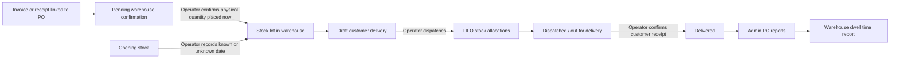

# Warehouse operations and dwell reporting

This module turns document-derived arrivals into an auditable physical stock ledger. It is intentionally separate from the Purchase Order waiting-time report:

- PO waiting time measures `supplier delivery/upload date - PO date`.
- Warehouse placement is recorded automatically when the operator confirms that the physical quantity is now in warehouse stock.
- Warehouse dwell follows the client's definition: `customer delivery date - warehouse placement date`.
- Warehouse holding measures `dispatch date - warehouse placement date` and remains visible as the physical storage interval.

Showing both dwell and holding keeps the client-defined end-to-end measure while still exposing time physically held before dispatch.

## Roles and entry points

- `warehouse_operator`: may use the warehouse process overview and its three task pages to confirm physical arrivals, add opening stock, create customer deliveries, dispatch them, and mark them delivered. This role cannot view the dwell report.
- `admin`: may read **Admin > Purchase orders > Reports > Warehouse Dwell Time** at `/admin/purchase-orders/reports/warehouse-dwell` after admin OTP verification, but cannot mutate warehouse progress.
- `uploader`: has no warehouse access.

Administrators create a user under **Admin > Users** and choose **Warehouse operator**. The operator then signs in normally and is redirected to `/warehouse/dashboard`.

## State flow



The linked PO/invoice row already records ordered quantity, supplier-delivered quantity, supplier delivery/upload date, and PO waiting time. It does not create dispatchable stock by itself. Stock becomes available only when a warehouse operator confirms that the physical quantity has been placed in the warehouse; the server records that placement time and operator automatically.

Every physical receipt becomes a stock lot. Every dispatch creates durable allocations between a customer-delivery line and one or more lots. Those allocations, not a later guess, are the basis of the report.

## Daily operator procedure

### 1. Confirm new arrivals

1. Open **Warehouse > Confirm arrivals** (`/warehouse/arrivals`).
2. Review the PO date, ordered quantity, supplier-delivered quantity, supplier delivery date, and calculated PO waiting time against the physical goods and receiving evidence.
3. Select **Place in warehouse**.
4. Confirm the physical quantity placed and optionally enter a batch/lot number or notes.
5. Select **Confirm placed in warehouse**. The server records the current date/time and acting user; this starts dwell tracking and makes the stock dispatchable.

The action is idempotent: retrying the same document line does not create a second stock lot.

### 2. Record stock that existed before go-live

Open **Warehouse > Inventory** (`/warehouse/inventory`). Use **Opening stock** for inventory already in the warehouse when this ledger starts.

- Use **Confirmed** when the physical arrival date is supported by evidence.
- Use **Estimated** when the date is a documented approximation.
- Use **Unknown** when there is no defensible date. Do not invent July 1 simply to make the report complete.

Opening stock with an unknown date is assumed to predate subsequently confirmed receipts for FIFO allocation, but its dwell value remains unknown.

### 3. Create and dispatch a customer delivery

1. Open **Warehouse > Customer deliveries** (`/warehouse/deliveries`) and select **New delivery**.
2. Enter one customer and an optional delivery reference.
3. Add one or more item quantities. A delivery can consolidate different items for that customer.
4. Save the draft.
5. When the goods physically leave the warehouse, select **Dispatch** and enter the dispatch date.

Dispatch allocates stock atomically by FIFO. Unknown-date opening stock is considered first, followed by the oldest known eligible receipt. Stock received after the dispatch date is never eligible. If any item in the consolidated delivery is short, the whole dispatch rolls back and remains a draft.

### 4. Confirm customer delivery

After the customer receives the goods, select **Mark delivered** and enter the customer receipt date. It cannot precede the dispatch date. Repeated dispatch or delivery submissions do not duplicate allocations or progress events.

## Mixed old and new stock

The system does not try to identify individual interchangeable pieces. It identifies the quantities consumed from durable stock lots.

Example:

- 300 Downy arrived July 1.
- 1,000 Downy arrived July 5.
- 500 Downy were dispatched July 6 and delivered July 7.

FIFO allocates 300 from July 1 and 200 from July 5. The delivery-line warehouse dwell is quantity-weighted:

```text
((300 x 6 days) + (200 x 2 days)) / 500 = 4.4 days
```

Warehouse holding time to dispatch is:

```text
((300 x 5 days) + (200 x 1 day)) / 500 = 3.4 days
```

This solves the old-versus-new PO ambiguity without pretending the cartons remain physically distinguishable after they are mixed.

## Unknown dates and report coverage

If 300 of a 500-piece delivery came from unknown-date opening stock and 200 came from a July 1 lot, the report shows:

- dated quantity coverage: `200 / 500 = 40%`;
- dwell calculated from the 200 pieces with a defensible arrival date;
- the unknown allocation in the FIFO lot detail.

The report never treats unknown as zero days and never substitutes the PO date or supplier delivery/upload date for a missing opening-stock date.

Filters use the confirmed customer-delivery date. Each report row represents one item line for one customer delivery. Expand **FIFO lot allocations** to audit the source PO, batch, quantity, date quality, and dwell contribution.

Warehouse operators finish their workflow after customer receipt confirmation. An administrator generates and reviews the report from **Admin > Purchase orders > Reports > Warehouse Dwell Time**. Keeping the report out of the operator workspace separates physical stock updates from management reporting.

## Data and audit model

- `warehouse_items`: stable inventory identity used across POs and customer orders.
- `warehouse_stock_lots`: confirmed arrival or opening-balance quantities and date quality.
- `warehouse_deliveries` and `warehouse_delivery_lines`: customer progress from draft to dispatched to delivered.
- `warehouse_allocations`: immutable FIFO quantity links between delivery lines and stock lots.
- `warehouse_progress_events`: actor, transition, event date, and safe metadata.
- `activity_logs`: user-facing audit events for each warehouse mutation.

Document-derived arrivals use a stable extraction-line source key so reconciliation reprocessing cannot count the same confirmed receipt twice. If corrected extraction materially changes an already confirmed physical receipt, handle that as a supervised inventory correction rather than confirming it again.

## Guardrails and currently unsupported cases

The first release deliberately does not automate returns, damaged-stock write-offs, warehouse transfers, delivery cancellation after dispatch, delivery-line edits after dispatch, or inventory corrections. These require explicit adjustment transaction types so stock history is never rewritten. Do not directly edit warehouse tables to simulate them.

Other boundaries:

- One delivery record represents one customer. Create separate deliveries when a truck carries consolidated goods for different customers.
- Quantities for one warehouse item must use its base unit; unit conversion is not inferred.
- Physical serial/batch traceability is available only when operators record a lot number. FIFO remains the allocation policy for interchangeable stock.
- Historical dwell is available only after a delivery reaches **Delivered**.

## Deployment and verification

Deploy the schema and refresh seeded permissions:

```powershell
php artisan migrate --seed
npm run build
```

Verify with:

```powershell
php artisan test tests/Feature/Warehouse/WarehouseDwellWorkflowTest.php
php artisan route:list --name=warehouse
php artisan route:list --name=admin.purchase-orders.reports.warehouse-dwell
```

Existing admin and uploader users keep their roles. Create dedicated warehouse-operator accounts; do not share an operator login because progress events record the acting user.
