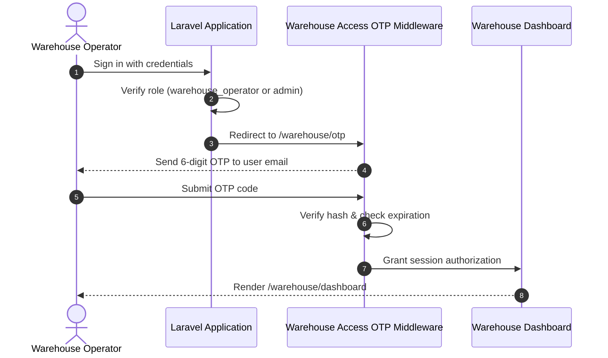
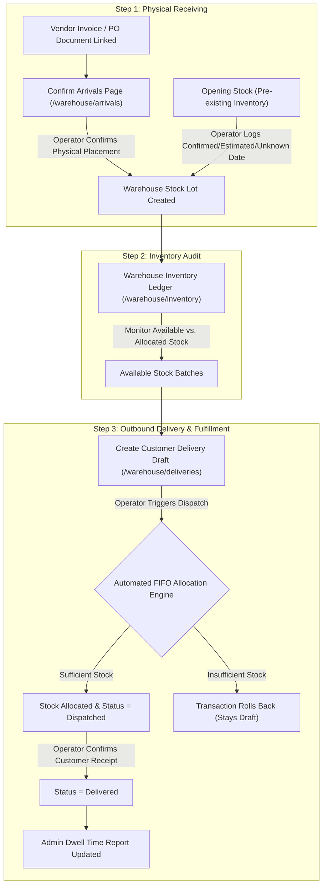
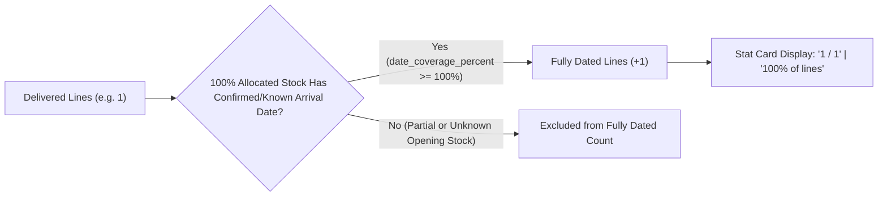

# Warehouse Operator Workspace: UI, Process Flow & Business Logic Reference

This document provides a comprehensive analysis of the **Warehouse Operator Workspace**, detailing its user interface (UI) components, operational process flow, underlying business logic, state machine rules, and security controls.

---

## 1. Architectural Purpose & Overview

The Warehouse Operator Workspace turns document-derived arrivals (Purchase Orders and vendor invoices/receipts) into an **auditable physical stock ledger**, manages outbound customer orders, executes automated **First-In-First-Out (FIFO)** inventory allocation upon dispatch, and tracks physical warehouse holding and dwell history.

### Core Objectives
- **Verify Physical Goods**: Confirm when supplier-delivered goods physically arrive and are placed into warehouse storage.
- **Maintain Stock Ledger**: Track available vs. allocated stock quantities across batches/lots with date-quality indicators.
- **Execute Outbound Deliveries**: Fulfill customer orders by automatically allocating the oldest eligible stock via FIFO.
- **Enable Dwell Time Reporting**: Provide clean, quantity-weighted holding data for administrative oversight without exposing management analytics to daily operators.

---

## 2. Security, Authorization & OTP Gate

Access to the warehouse workspace is strictly gated by role-based authorization and two-factor step-up verification:



- **Required Permissions**: `access_warehouse` (view pages) and `manage_warehouse_operations` (mutate stock/deliveries).
- **OTP Verification (`/warehouse/otp`)**:
  - Middleware: `warehouse.otp` intercepting all `/warehouse/*` endpoints.
  - Throttling: `throttle:admin-otp` limits rapid submission/resend attempts.
  - Storage: Verification tokens are stored as SHA-256 hashes in `warehouse_access_otps`.

---

## 3. System Process Architecture & State Flow

The workspace is organized around a strict 3-step sequential workflow:



---

## 4. Detailed UI & Business Logic Breakdown

### Page 1: Process Overview Dashboard (`/warehouse/dashboard`)

#### UI Layout & Components
- **Header Shell**: Displays the workspace title and brief process instructions.
- **Vertical Process Flow Timeline**: Interactive card list representing the 3 sequential steps:
  - **Step 1: Confirm arrivals** (`/warehouse/arrivals`): Displays pending arrival count pill (urgent amber badge if $>0$).
  - **Step 2: Review inventory** (`/warehouse/inventory`): Displays item and stock batch counts.
  - **Step 3: Process deliveries** (`/warehouse/deliveries`): Displays draft and dispatched delivery metrics.
- **Process Guidance Banner**: Explains why sequence matters (*Confirm arrival creates stock $\rightarrow$ Inventory shows available stock $\rightarrow$ Dispatch reserves oldest stock via FIFO*).

#### Logic & Controllers
- **Controller**: `WarehouseDashboardController`
- **Data Hydration**: Queries pending arrival counts, unique item totals, active stock lots, draft deliveries, and dispatched deliveries in parallel.

---

### Page 2: Step 1 – Confirm Warehouse Arrivals (`/warehouse/arrivals`)

#### UI Layout & Components
- **Process Navigation Header (`WarehouseProcessNav`)**: Persistent tab bar indicating current progress stage.
- **Dual View Mode Toggle**:
  - **By PO View (`by-po`)**: Groups pending items by Purchase Order number into visual cards showing vendor name, PO date, calculated PO waiting time, and total item count. Includes a **"Confirm PO Arrival"** batch button.
  - **By Line Item View (`by-item`)**: Granular table listing individual arrival records with real-time debounced search input (filters by PO number, SKU, item code, description).
- **Confirmation Modals**:
  - **Single-Item Modal**: Displays expected PO date, ordered quantity, supplier-delivered quantity, and calculated PO waiting time (`supplier delivery date - PO date`). Allows adjusting quantity received and adding optional lot/batch numbers or notes.
  - **Batch PO Modal**: Confirms all line items for a given Purchase Order in a single click.

```mermaid
ui-mockup
+-----------------------------------------------------------------------------------+
|  Confirm Warehouse Arrivals                                                       |
|  [ Step 1: Arrivals (Active) ]   [ Step 2: Inventory ]   [ Step 3: Deliveries ]    |
+-----------------------------------------------------------------------------------+
|  [ Search by PO, SKU, Description... ]                   [ Mode: By PO | By Item ]|
+-----------------------------------------------------------------------------------+
|  PO #PO-2026-00412  | Vendor: BONITA LOGISTICS | PO Date: 2026-07-15             |
|  Waiting Time: 3 days | Pending Items: 4 lines                                    |
|  [ View Item Details ]                                 [ Confirm PO Arrival ]     |
+-----------------------------------------------------------------------------------+
```

#### Under-the-Hood Business Logic
- **Controller**: `WarehouseArrivalsController` / `WarehouseOperationsController`
- **Idempotency Engine**: Uses a deterministic `source_key` (`ai:{id}:line:{index}`). Re-confirming an already processed arrival returns the existing stock lot without duplicating inventory.
- **Concurrency Locking**: Executes `lockForUpdate()` inside a DB transaction to prevent race conditions between operators.
- **Stock Lot Generation (`WarehouseOperations::confirmArrival`)**:
  - Resolves canonical item via `WarehouseItemResolver`.
  - Creates `warehouse_stock_lots` with `source_type = 'arrival'`, `quantity_received`, `received_at = now()`, and records `confirmed_by_user_id`.
  - Logs a `warehouse_progress_events` audit row (`stock_lot`, `in_warehouse`).

---

### Page 3: Step 2 – Review Inventory & Add Opening Stock (`/warehouse/inventory`)

#### UI Layout & Components
- **Top Metric Cards**: Displays **Total Items**, **Stock Batches**, and **Total Available Units**.
- **Search & Filter Controls**: Debounced search for SKU, normalized description, or lot number.
- **Stock Ledger Table**: Shows SKU, description, lot number, date quality badge (`Confirmed`, `Estimated`, `Unknown`), placement timestamp, received quantity, allocated quantity, and net available stock.
- **"Record Opening Stock" Dialog**: Form for logging pre-existing inventory present before system go-live:
  - Fields: Item description, SKU, quantity, unit, lot/batch number, placement date, date quality selection (`Confirmed`, `Estimated`, `Unknown`), notes.

#### Under-the-Hood Business Logic
- **Controller**: `WarehouseInventoryController` / `WarehouseOperationsController`
- **Item Identity Resolution**: Standardizes inventory identity using normalized SKU and lowercased alphanumeric description hashes (`identity_key`).
- **Date Quality Enums (`WarehouseDateQuality`)**:
  - `Confirmed`: Arrival date supported by documented evidence.
  - `Estimated`: Approximate arrival date.
  - `Unknown`: Date unavailable (`received_at = NULL`).
- **No Date Fabrication Rule**: Unknown dates are never assigned arbitrary fallback dates. In FIFO queries, unknown-date stock is allocated *first* (assumed oldest pre-existing stock), but it contributes $0$ days to dated dwell time averages.

---

### Page 4: Step 3 – Process Customer Deliveries (`/warehouse/deliveries`)

#### UI Layout & Components
- **Status Filter Tabs**: `Draft`, `Dispatched`, `Delivered`, `All Deliveries`.
- **Top Action Buttons**: **"New Delivery"** (single order) and **"Bulk Create"** (consolidated shipment).
- **Deliveries & Shipments Table**: Grouped view by Shipment Reference (`TRK-YYYYMMDD-XXXX`) or Delivery Reference (`DEL-YYYYMMDD-XXXX`). Shows customer name, sales order, PO, status badge, delivery lines, dispatch date, and delivery date.
- **Interactive Modals**:
  - **Create / Edit Delivery Modal**: Add/remove dynamic item rows, select items from catalog, enter quantities.
  - **Dispatch Confirmation Modal**: Prompts for dispatch timestamp (`dispatched_at`).
  - **Mark Delivered Modal**: Prompts for customer receipt timestamp (`delivered_at`).

```mermaid
ui-mockup
+-----------------------------------------------------------------------------------+
|  Customer Deliveries & Shipments                                                  |
|  [ Drafts (2) ]  [ Dispatched (1) ]  [ Delivered (5) ]  [ All ]                     |
|                                         [ + New Delivery ]  [ Bulk Shipment ] |
+-----------------------------------------------------------------------------------+
|  Shipment TRK-20260729-A1B2  | Customer: ACME CORP | Status: DRAFT              |
|  Lines: 2 items (500 units Total)                                                 |
|  [ Edit Order ]  [ Delete Draft ]                        [ Dispatch Shipment ]    |
+-----------------------------------------------------------------------------------+
```

#### Under-the-Hood Business Logic & Automated FIFO Engine

##### State Machine Rules

| State | Allowed Actions | Business Rules & Validations |
| :--- | :--- | :--- |
| **Draft** | Edit, Delete, Dispatch | Delivery order created. Items and requested quantities can be modified. No stock is locked or reserved yet. |
| **Dispatched** | Mark Delivered | **Automated FIFO Allocation Engine Executed** (see details below). Stock allocations are created, reserving stock. |
| **Delivered** | View Audit Details | Operator confirms customer receipt. Date must be $\ge$ dispatch date. Finalizes order for management dwell reporting. |

##### Automated FIFO Allocation Algorithm (`WarehouseOperations::dispatchSingleDelivery`)

When an operator dispatches a delivery, the server executes the following atomic algorithm inside a database transaction:

```text
1. Lock delivery lines for update.
2. For each requested item line:
   a. Calculate remaining required quantity.
   b. Query warehouse_stock_lots for item where (received_at IS NULL OR received_at <= dispatchDate).
   c. Sort lots: Unknown date first (received_at IS NULL), then oldest received_at ASC, then Lot ID ASC.
   d. For each lot:
      i. Calculate available_quantity = lot.quantity_received - SUM(existing_allocations).
      ii. If available_quantity > 0:
          - take_quantity = MIN(available_quantity, remaining_quantity)
          - Create warehouse_allocations (line_id, lot_id, take_quantity, method='fifo')
          - remaining_quantity -= take_quantity
      iii. If remaining_quantity == 0, break loop.
   e. If remaining_quantity > 0 after examining all lots:
      - Throw ValidationException ("Insufficient stock for item X").
      - Roll back entire transaction (delivery remains in Draft state).
3. Update delivery status to 'dispatched', set dispatched_at = dispatchDate, record acting user ID.
4. Log progress event ('delivery', 'dispatched').
```

---

## 5. Warehouse Dwell Report Metrics & Date Coverage

Admin users viewing the **Warehouse Dwell Time Report** (`/admin/purchase-orders/reports/warehouse-dwell`) see key stat cards summarizing physical holding performance and date auditability:



### Stat Card Metric Definitions

| Metric Label | UI Format Example | Backend Calculation & Logic | Description |
| :--- | :--- | :--- | :--- |
| **Delivered item lines** | `1` | `count(delivered_lines)` | Total number of delivered item lines fulfilled in the selected date range. |
| **Fully dated lines** | `1 / 1`<br>*(Detail: `100% of lines`)* | Value: `${fully_dated_lines} / ${delivered_lines}`<br>Detail: `${date_coverage_percent}% of lines` | **Fully Dated Lines Count**: Delivered lines where 100% of the allocated stock quantity has a confirmed/known placement date (`date_coverage_percent >= 100.0`).<br>**Fraction Format (`1 / 1`)**: Shows `fully_dated_lines / delivered_lines`.<br>**Percentage Format (`100% of lines`)**: Shows `(fully_dated_lines / delivered_lines) * 100`. |
| **Average warehouse holding** | `X.X days` | `SUM(holdingDays * qty) / SUM(knownQty)` | Quantity-weighted average days goods physically spent in the warehouse prior to dispatch (`dispatched_at - received_at`). |
| **Average warehouse dwell** | `X.X days` | `SUM(dwellDays * qty) / SUM(knownQty)` | Quantity-weighted average days between physical placement and customer delivery (`delivered_at - received_at`). |
| **Maximum batch dwell** | `X days` | `MAX(dwellDays)` | Longest single batch storage duration recorded in the report period. |

### Multi-Batch Quantity-Weighted Dwell Logic

When a single customer delivery line consumes stock from **multiple batches/lots with different arrival dates**, the system calculates a **quantity-weighted average** instead of simple unweighted averages:

$$\text{Weighted Dwell Days} = \frac{\sum (\text{Allocated Quantity}_i \times \text{Dwell Days}_i)}{\sum \text{Allocated Quantity}_i}$$

$$\text{Weighted Holding Days} = \frac{\sum (\text{Allocated Quantity}_i \times \text{Holding Days}_i)}{\sum \text{Allocated Quantity}_i}$$

#### Concrete Multi-Batch Example:
- **Order Request**: Customer orders **500 units** of Item X.
- **Batch A (Older)**: 300 units arrived July 1. Dispatched July 6 (Holding = 5 days), Delivered July 7 (Dwell = 6 days).
- **Batch B (Newer)**: 200 units arrived July 5. Dispatched July 6 (Holding = 1 day), Delivered July 7 (Dwell = 2 days).

$$\text{Warehouse Dwell} = \frac{(300 \times 6\text{ days}) + (200 \times 2\text{ days})}{500\text{ units}} = \frac{1800 + 400}{500} = \mathbf{4.4\text{ days}}$$

$$\text{Warehouse Holding} = \frac{(300 \times 5\text{ days}) + (200 \times 1\text{ day})}{500\text{ units}} = \frac{1500 + 200}{500} = \mathbf{3.4\text{ days}}$$

$$\text{Maximum Batch Dwell} = \max(6, 2) = \mathbf{6\text{ days}}$$

---

## 6. Summary Table of Routes, Permissions & Actions


| Page / Route | HTTP Method | Action / Endpoint | Permission Required | Primary Function |
| :--- | :---: | :--- | :--- | :--- |
| `/warehouse/otp` | `GET/POST` | `WarehouseAccessOtpController` | `access_warehouse` | Step-up OTP authentication gate |
| `/warehouse/dashboard` | `GET` | `WarehouseDashboardController` | `access_warehouse` | Process guidance dashboard |
| `/warehouse/arrivals` | `GET` | `WarehouseArrivalsController` | `access_warehouse` | View pending document arrivals |
| `/warehouse/arrivals/{id}/confirm` | `POST` | `confirmArrival` | `manage_warehouse_operations` | Confirm single arrival into stock |
| `/warehouse/arrivals/confirm-by-po` | `POST` | `confirmArrivalsByPo` | `manage_warehouse_operations` | Batch confirm PO arrivals into stock |
| `/warehouse/inventory` | `GET` | `WarehouseInventoryController` | `access_warehouse` | Audit stock ledger & batches |
| `/warehouse/opening-stock` | `POST` | `storeOpeningStock` | `manage_warehouse_operations` | Log pre-existing inventory |
| `/warehouse/deliveries` | `GET` | `WarehouseDeliveriesController` | `access_warehouse` | View customer delivery orders |
| `/warehouse/deliveries` | `POST/PUT/DELETE`| `storeDelivery` / `update` / `destroy` | `manage_warehouse_operations` | Manage draft delivery orders |
| `/warehouse/deliveries/{id}/dispatch` | `POST` | `dispatch` | `manage_warehouse_operations` | Execute FIFO allocation & dispatch |
| `/warehouse/deliveries/{id}/deliver` | `POST` | `deliver` | `manage_warehouse_operations` | Confirm customer receipt |

---

## 7. Key Design Principles & Safety Guarantees

1. **Transactional Integrity**: All inventory and delivery operations are wrapped in retryable database transactions with explicit pessimistic row locks (`lockForUpdate()`).
2. **Atomic Rollback**: If a consolidated shipment contains 10 items and 1 item has insufficient stock, the entire dispatch fails without leaving partial allocations.
3. **Auditability**: Every status change generates a `warehouse_progress_events` entry recording the exact timestamp, from/to states, actor user ID, and metadata.
4. **Idempotency**: Retrying network requests for arrivals or dispatch execution will not duplicate stock lots or allocations.

